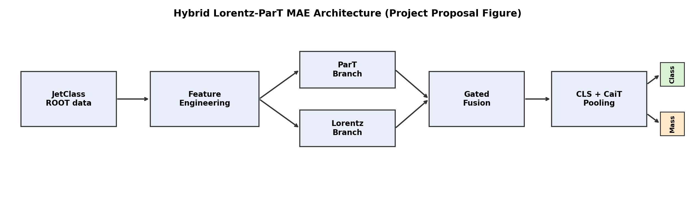
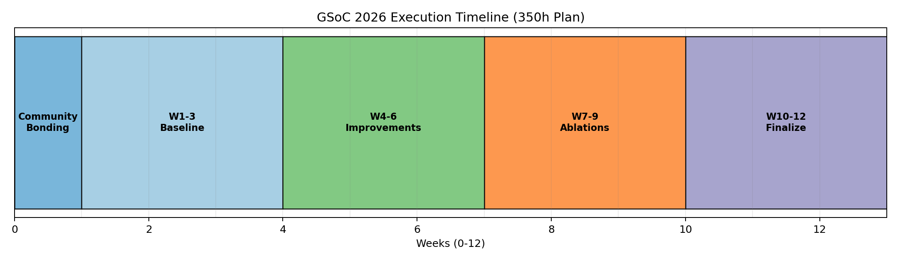
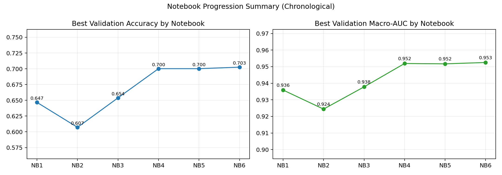

# Event Classification with Masked Transformer Autoencoders

## Overview
This repository documents a notebook-first research journey for **jet event classification** in the ML4SCI/CMS setting.

The full workflow is developed and improved through the notebook series in `notebook/`, where each next notebook refines training stability, model quality, and evaluation reliability.

The model direction combines:
- Lorentz-aware modeling ideas,
- transformer-based particle interaction modeling,
- masked autoencoder (MAE) pretraining before supervised fine-tuning.

---

## Why this project matters
For this problem, good results are not just a single final score.
This work tracks three practical goals across notebook iterations:
1. Better classification performance (accuracy and macro AUC),
2. Better run-to-run stability across random seeds,
3. Better evidence through ablations and structured comparisons.

---

## Problem setup (as used in notebooks)
- Dataset size used in workflow: `100,000` events
- Data split: `80%` train / `10%` validation / `10%` test
- Task: multi-class jet event classification
- Notebook objective: improve baseline pipeline in measurable, reproducible steps

---

## Implementation approach (notebook-driven)
The repository was developed as an iterative notebook pipeline instead of one-shot optimization.

High-level flow followed in the notebooks:
- Build a baseline hybrid architecture and full training/evaluation path,
- Add MAE pretraining and compare against no-pretraining baselines,
- Add multi-seed analysis to reduce single-run bias,
- Consolidate improvements in later notebooks and finalize benchmark settings.

This progression is what produced the final performance jump and improved consistency.

---

## Final headline results
From `notebook/6-Hybrid_LorentzParT_MAE_GSoC2026_FINAL -.ipynb`:
- **Test Accuracy:** `0.7020` (70.2%)
- **Macro AUC (OvR):** `0.9536`
- **Macro AUC (OvO):** `0.9536`

### MAE pretraining effect (final notebook summary)
- **Accuracy gain:** `+0.0282` (~+2.8%)
- **AUC gain:** `+0.0070`
- Reported as substantially lower variance with pretraining in multi-seed comparisons

---

## Notebook Journey (research progression)
Each notebook is a concrete stage in the model evolution.

| Notebook | What changed in this stage | Reported test accuracy | Reported macro AUC (OvR) |
|---|---|---:|---:|
| `1-Hybrid_Lorentz_ParT_MAE_JetClass_GSoC2026.ipynb` | Initial complete hybrid MAE pipeline with baseline ablations/diagnostics | `0.6467` | `0.938316` |
| `2-Hybrid_Lorentz_ParT_MAE_JetClass_GSoC2026 .ipynb` | Added stronger scheduler/logging organization and explicit multi-seed evaluation structure | `0.6093` | `0.9267` |
| `3-Hybrid_Lorentz_ParT_MAE_JetClass_GSoC2026.ipynb` | Added mass-target normalization and training behavior tuning | `0.6464` | `0.9393` |
| `3_v6-Hybrid_Lorentz_ParT_MAE_JetClass_GSoC2026.ipynb` | Stronger pretraining + longer fine-tuning strategy | `0.7018` | `0.9524` |
| `4-Hybrid_Lorentz_ParT_MAE_JetClass_GSoC2026.ipynb` | Consolidated improvements and stricter seeded robustness checks | `0.6968` | `0.9521` |
| `6-Hybrid_LorentzParT_MAE_GSoC2026_FINAL -.ipynb` | Final polished benchmark configuration | **`0.7020`** | **`0.9536`** |

### Interpreting the journey
- Intermediate steps are not strictly monotonic, which is expected in real experimentation.
- The major jump appears in the `3_v6` stage onward.
- Final notebooks preserve these gains while improving reproducibility discipline.

### What was changed in each next notebook to improve implementation
- **NB1 → NB2**
  - Added clearer scheduler/logging flow and explicit multi-seed evaluation block.
  - Improvement target: better reliability and easier apples-to-apples comparisons.

- **NB2 → NB3**
  - Added mass-target normalization and tuning updates.
  - Improvement target: recover performance and improve feature-scale handling.

- **NB3 → NB3_v6**
  - Strengthened MAE pretraining and extended fine-tuning strategy.
  - Improvement target: improve latent representation quality before supervised optimization.

- **NB3_v6 → NB4**
  - Consolidated successful changes and enforced stronger seeded checks.
  - Improvement target: verify gains are stable across runs.

- **NB4 → NB6 (Final)**
  - Finalized benchmark configuration and optimization stack.
  - Improvement target: maximize final score while preserving reproducibility.

---

## Stability & reproducibility evidence
From `notebook/4-Hybrid_Lorentz_ParT_MAE_JetClass_GSoC2026.ipynb` multi-seed summary:

- **With pretraining:**
  - `test_acc = 0.6993 ± 0.0013`
  - `test_auc_ovr = 0.9524 ± 0.0006`

- **Without pretraining:**
  - `test_acc = 0.6866 ± 0.0059`
  - `test_auc_ovr = 0.9490 ± 0.0014`

Key point: pretraining improves both average performance and run-to-run stability.

---

## Ablation insights
From final notebook ablation outputs:
- `with_mae_pretrain`: `val_acc = 0.5961`, `val_auc = 0.919528`
- `no_mae_pretrain`: `val_acc = 0.5726`, `val_auc = 0.911468`

These ablations are consistent with final test trends and support the core project claim that MAE pretraining helps downstream classification quality.

---

## Architecture and training design notes (from notebook sections)
The final pipeline integrates:
- hybrid branch design with attention-gated fusion,
- MAE pretraining followed by supervised fine-tuning,
- class-attention/CLS-style decision structure,
- optional mass-regression study branch,
- engineering optimizations (`torch.compile`, cuDNN benchmark usage in final notebook).

---

## Visual notebook journey
### Proposal and planning visuals

### Data and feature/training pipeline views

### Core architecture and performance evidence

---

## Repository structure
- `notebook/` — complete notebook lifecycle from baseline to final benchmark
- `images/` — all plots and explanatory figures used in this README
- `Research paper/` — local reference PDFs
- `README.md` — notebook-driven narrative summary
- `readme (2).md` — format/style reference used for this README rewrite

---

## How to read this work in order
1. `notebook/1-Hybrid_Lorentz_ParT_MAE_JetClass_GSoC2026.ipynb`
2. `notebook/2-Hybrid_Lorentz_ParT_MAE_JetClass_GSoC2026 .ipynb`
3. `notebook/3-Hybrid_Lorentz_ParT_MAE_JetClass_GSoC2026.ipynb`
4. `notebook/3_v6-Hybrid_Lorentz_ParT_MAE_JetClass_GSoC2026.ipynb`
5. `notebook/4-Hybrid_Lorentz_ParT_MAE_JetClass_GSoC2026.ipynb`
6. `notebook/6-Hybrid_LorentzParT_MAE_GSoC2026_FINAL -.ipynb`

Recommended pattern per notebook:
1. introduction/improvement and scope,
2. model/data sections,
3. pretraining/fine-tuning outputs,
4. ablation and multi-seed outputs,
5. final discussion block.

---

## Conclusion
This repository shows a full notebook-to-benchmark journey where MAE pretraining and iterative architecture/training refinements improved both quality and stability.

The final notebook result (`0.7020` accuracy, `0.9536` macro AUC) is the endpoint of staged improvements rather than a single isolated run.
