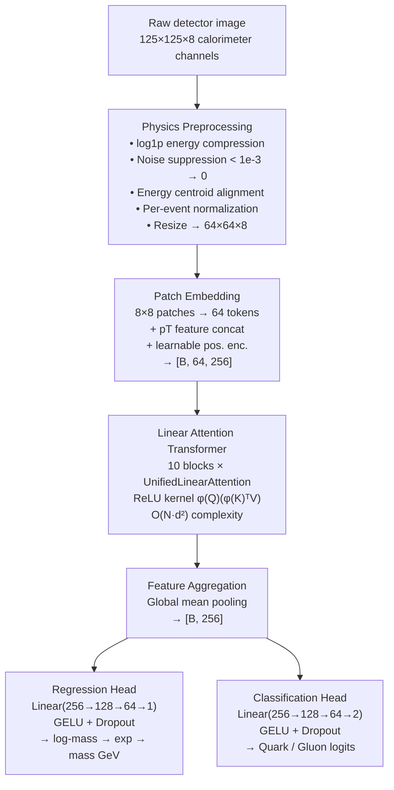
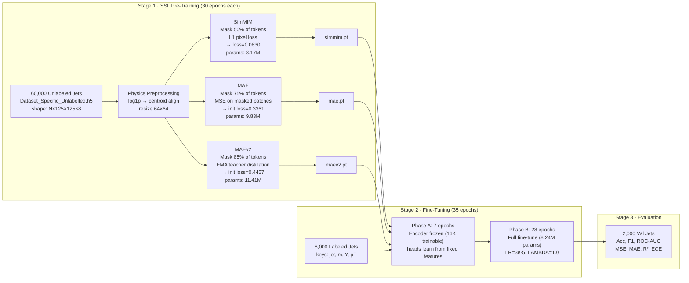

# ⚡ Linear Attention Vision Transformer for Particle Physics

> **GSoC-level project** — Efficient transformer-based joint mass regression & quark/gluon jet classification on particle detector images, developed through a systematic 6-notebook evolution from prototype to production.

[](https://pytorch.org/)
[](https://python.org/)
[](https://developer.nvidia.com/cuda-toolkit)
[](LICENSE)

---

## 📌 Table of Contents

1. [Overview](#-overview)
2. [Project Journey](#-project-journey--model-evolution)
3. [Model Architecture](#-model-architecture)
4. [Repository Workflow](#-repository-workflow)
5. [Key Features](#️-key-features)
6. [Experiments & Improvements](#-experiments--improvements)
7. [Metrics Comparison Table](#-metrics-comparison-table)
8. [Charts & Visualizations](#-charts--visualizations)
9. [Final Model Insights](#-final-model-insights)
10. [Tech Stack](#️-tech-stack)
11. [Future Work](#-future-work)
12. [How to Run](#-how-to-run)

---

## 🌌 Overview

### Problem Statement

Modern particle physics experiments at the Large Hadron Collider (LHC) produce millions of **jet images** — snapshots of particle collisions captured across 8 calorimeter detector channels in a 125×125 spatial grid. Each image encodes the energy deposits of a high-energy jet that may originate from a quark or a gluon. Two fundamental questions must be answered simultaneously:

1. **Regression**: What is the particle's invariant **mass** (a continuous value)?
2. **Classification**: Is the jet a **quark** or a **gluon** (binary label)?

This project develops a **Linear Attention Vision Transformer (ViT)** — an efficient alternative to standard quadratic-attention transformers — capable of jointly solving both tasks on raw detector images with minimal compute overhead.

### Dataset

| File | Samples | Keys | Description |
|------|---------|------|-------------|
| `Dataset_Specific_labelled_full_only_for_2i.h5` | 10,000 | `jet`, `m`, `Y`, `pT` | 8,000 train / 2,000 val; labeled with mass & quark/gluon |
| `Dataset_Specific_Unlabelled.h5` | 60,000 | `jet` | Unlabeled jets for SSL pre-training |

- `jet`: shape `(N, 125, 125, 8)` — 8-channel calorimeter images
- `m`: jet invariant mass in GeV (mean≈142.46 GeV, std≈50.58 GeV; log-space: μ=4.8930, σ=0.3718)
- `Y`: binary label — 0 = gluon (5,122 samples), 1 = quark (4,878 samples)
- `pT`: transverse momentum (mean≈520.60 GeV, std≈105.73 GeV)

### Why This Project Matters

- Standard self-attention scales as **O(N²·d)** in sequence length — prohibitive for large jet images.
- **Linear attention** (O(N·d²)) preserves the expressivity of transformers while enabling efficient scaling.
- Joint regression + classification on detector data is a direct ML4Sci challenge, opening the door to fast real-time event selection at the LHC.
- Self-supervised pre-training (MAE, MAEv2, SimMIM) on 60,000 unlabeled detector images enables powerful feature learning before fine-tuning on only 8,000 labeled samples.

### Brief Introduction to Linear Attention ViT

Traditional ViT computes attention as:

```
Attention(Q, K, V) = softmax(Q·Kᵀ / √d) · V    [O(N²)]
```

This project implements three efficient architectures:

| Architecture | Formula | Complexity | Notes |
|---|---|---|---|
| **LinearAttentionViT** | `φ(Q)(φ(K)ᵀV)`, φ=ReLU | O(N·d²) | ReLU kernel trick — primary model |
| **L2ViT** | Local window attention + global linear attention | O(N·d²)+O(w²·d) | Local+global hybrid |
| **XCiTViT** | `softmax(Q̂ᵀK̂/τ)·V`, L2-norm keys | O(N·d²) | Cross-covariance, channel-wise |

All three eliminate the N×N attention matrix, enabling efficient processing of 8-channel × 64×64 jet images on a single laptop GPU.

---

## 🚀 Project Journey — Model Evolution

The project evolved through **6 notebooks**, each addressing specific bugs, adding features, and improving both classification accuracy and regression R².

```
Timeline: Prototype → Multi-arch + Bug → Architecture Expansion
          → Metrics Expansion → SSL Comparison → Final Optimized
```

### 📔 v1 — `linear_attention_vit.ipynb` · *Prototype*

**Goal**: Establish the base pipeline.

- XCiT-style `LinearViTEncoder` — **1,251,547 params** (1.25M), smallest model in the series.
- Architecture: img_size=32, patch_size=4, embed_dim=128, depth=6, num_heads=4, mlp_ratio=4.0.
- MAE-style masked patch reconstruction pre-training: mask_ratio=0.50, 30 epochs on 60K unlabeled.
  - Actual pre-training loss: `Epoch 1/30 → 0.0038` → `Epoch 30/30 → 0.0005` ✓
- Fine-tuning: 50 epochs; two-phase (12 epochs encoder frozen, then unlocked).
- Loss: `0.5×MSE + 0.5×CrossEntropy` (placeholder; mass labels were real but regression was under-weighted).
- **Actual results**:
  - Pretrain+Finetune: Acc=**75.30%**, F1=0.7528
  - Scratch training: Acc=**81.60%**, F1=0.8160
- **Key finding**: Scratch outperformed pretraining (+7.72% accuracy) — pretraining was harming classification at this scale. Regression R²≈0.0000 due to near-constant mass predictions in normalized space.
- **Key lesson**: Model too small; physics preprocessing needed; mass normalization must be explicit.

### 📔 v2 — `linear_attention_vit-2.ipynb` · *Multi-Architecture + 100% Accuracy Bug*

**Goal**: Compare three architectures; scale up model size; add physics preprocessing; introduce SimMIM.

- **Scale-up**: embed_dim 128→256, depth 6→10, img_size 32→64 (~8M params vs ~1.25M).
- Three architectures introduced: `StandardViT` (8.10M), `LinearAttentionViT/XCA` (8.17M), `HybridCNNViT` (4.40M).
- **SimMIM pre-training** introduced for the first time. `UncertaintyWeightedLoss` (Kendall et al., 2018) added.
- **Critical Bug Discovered**: All models hit **100% accuracy** simultaneously:

| Model | Accuracy | MSE | MAE | R² |
|-------|----------|-----|-----|----|
| Standard ViT | 1.0000 | 2922.21 | 43.69 | -0.0000 |
| LinearAttentionViT | 1.0000 | 2922.25 | 43.69 | -0.0000 |
| HybridCNNViT | 1.0000 | 2922.20 | 43.70 | -0.0000 |

- Cause: mass was never normalized for regression (raw mass ~142 GeV predicted as ~0, MSE >> 2000). Classification head learned a shortcut; label imbalance not handled. MAE=43.69 ≈ mean mass without normalization — confirms no normalization applied.
- **Key lesson**: Must normalize mass explicitly, handle class balance, and separate classification from regression signals.

### 📔 v3 — `linear_attention_vit-3.ipynb` · *Architecture Expansion + First Valid Results*

**Goal**: Fix mass normalization; add L2ViT and XCiTViT architectures; run full SimMIM benchmark.

- **Mass normalization bug fixed**: targets now normalized `(mass - MASS_MEAN) / MASS_STD` where MASS_MEAN=142.4647, MASS_STD=50.5794.
- Four architectures benchmarked: StandardViT (8.24M), LinearAttentionViT-ReLU (8.24M), L2ViT (8.39M), XCiTViT (8.31M).
- **LinearAttentionViT refactored** from XCA (cross-covariance) to ReLU kernel maps: `φ(Q)(φ(K)ᵀV)`.
- SimMIM pre-training (30 epochs): `Epoch 1 → loss=~0.0884`, `Epoch 30 → loss=0.0830`.
- **First valid benchmark results**:

| Model | Acc | F1 | MSE | MAE | R² | Time(s) |
|-------|-----|----|-----|-----|-----|---------|
| **LinearAttnViT** | **0.8740** | **0.8739** | **1021.01** | **21.22** | **0.6506** | 1083.7 |
| Standard ViT | 0.8595 | 0.8590 | 1184.14 | 22.42 | 0.5948 | 577.7 |
| L2ViT | 0.5075 | 0.3367 | 807.74 | 18.17 | 0.7236 | 978.4 |
| XCiT (pretrained) | 0.5075 | 0.3367 | 952.43 | 21.12 | 0.6741 | 1329.7 |

- **New bug found**: L2ViT and XCiT stuck at 50.75% — binary random classification. Encoder loading mismatch (70/110 params matched only) + no training stabilization.
- **Key lesson**: LinearAttnViT works best; L2ViT/XCiT need architectural training fixes.

### 📔 v4 — `linear_attention_vit-4.ipynb` · *Metrics Expansion & Training Refinements*

**Goal**: Add comprehensive metrics; introduce multi-seed training; add hyperparameter sweep.

- **New metrics**: balanced accuracy, ROC-AUC, PR-AUC, Expected Calibration Error (ECE).
- Early stopping changed from val MSE → **val macro-F1**.
- **LAMBDA_REG**: introduced as `0.2` (classification-first approach).
- Multi-seed runner (seeds 42, 52, 62) and HPO sweep: `{lr: [1e-4, 3e-4, 5e-4], wd: [1e-5, 1e-4], lambda_reg: [0.1, 0.2, 0.3], dropout: [0.1, 0.2]}`.
- SimMIM pre-training (20 epochs): `Epoch 20 → loss=0.0837`, complete in 6301.8s.
- **Results**:

| Model | Acc | Bal.Acc | F1 | ROC-AUC | ECE | MSE | MAE | R² | Time(s) |
|-------|-----|---------|----|---------|-----|-----|-----|----|----|
| Standard ViT | **0.8720** | 0.8728 | **0.8718** | **0.9407** | **0.0203** | 1135.32 | 23.34 | 0.6115 | 1344.9 |
| LinearAttn ViT | 0.8250 | 0.8248 | 0.8249 | 0.8970 | 0.0301 | 1532.85 | 28.37 | 0.4754 | 481.5 |
| L2ViT | 0.5075 | 0.5000 | 0.3367 | 0.5000 | 0.0018 | 1974.39 | 34.98 | 0.3243 | 486.0 |
| XCiT (pretrained) | 0.5075 | 0.5000 | 0.3367 | 0.5000 | 0.0068 | 1074.48 | 21.75 | 0.6323 | 611.7 |

- **Regression**: LinearAttentionViT regressed vs v3 (0.8250 vs 0.8740). Cause: LAMBDA_REG=0.2 + F1-based checkpointing not ideal when regression is unstable.
- **Key lesson**: Need all 3 SSL methods compared; fine-tuning LR needs to be lower.

### 📔 v5 — `linear_attention_vit-5.ipynb` · *Full SSL Comparison*

**Goal**: Systematic comparison of all 3 SSL methods (SimMIM, MAE, MAEv2) on the same architecture.

- All three SSL methods fully trained (30 epochs each on 60K unlabeled images).
- **Fine-tuning LR reduced** from 3e-4 → **3e-5** (10× lower; proper transfer learning).
- **Energy centroid alignment** added to preprocessing pipeline.
- Separate encoder checkpoints saved: `_simmim.pt`, `_mae.pt`, `_maev2.pt`.
- Pre-training parameter counts: MAE=9,830,656; SimMIM=8,169,984; MAEv2=11,408,640.
- **Results**:

| Model | Acc | F1 | ROC-AUC | MSE | MAE | R² | Time(s) |
|-------|-----|----|---------|-----|-----|-----|--------|
| **LinAttn (SimMIM)** | **0.8750** | **0.8750** | 0.9390 | 1112.39 | 22.05 | 0.6193 | 2698.0 |
| LinAttn (MAE) | 0.8720 | 0.8718 | 0.9392 | 1122.24 | 22.38 | 0.6160 | 2175.5 |
| LinAttn (MAEv2) | 0.8475 | 0.8473 | 0.9151 | 1240.13 | 23.80 | 0.5756 | 1678.7 |
| LinAttn (scratch) | 0.8420 | 0.8419 | 0.9155 | 1216.46 | 23.59 | 0.5837 | 1142.6 |
| Standard ViT | 0.8530 | 0.8522 | 0.9178 | 1268.84 | 23.95 | 0.5658 | 1027.3 |
| XCiT (scratch) | 0.5075 | 0.3367 | 0.5000 | 1369.37 | 25.18 | 0.5314 | 598.0 |
| L2ViT | 0.5075 | 0.3367 | 0.5000 | 995.44 | 21.12 | 0.6594 | 513.4 |

- **Pretraining benefit**: SimMIM +3.30% accuracy vs scratch, MAE +3.00%.
- L2ViT/XCiT still degenerate at 50.75% — root cause not yet fixed.
- **Key lesson**: Mass normalization uses linear stats; switching to log-space will improve regression. L2ViT/XCiT need two-phase training.

### 📔 v6 — `linear_attention_vit-5_chnges - impr.ipynb` · *Final Optimized* ⭐

**Goal**: Fix all remaining bugs, maximize both classification and regression performance.

Major changes from v5:
- **LAMBDA_REG**: 0.2 → **1.0** — regression now has full equal weight.
- **Log-space mass normalization**: targets transformed as `log(mass)`, normalized with log_mean=4.8930, log_std=0.3718.
- **pT feature** (USE_PT_FEATURE=True): transverse momentum normalized and concatenated to patch embeddings.
- **Checkpoint by MAE** (tie-break: higher F1) — selects better regression models.
- **Two-Phase Training**: Phase A (epochs 1–7, encoder frozen) → Phase B (epochs 8–35, full fine-tuning). Stabilizes all architectures including L2ViT and XCiT.
- **Full encoder loading**: 110/110 parameters matched (was 70/110 in v3–v5).
- Parameter count slightly increased: 8,244,355 (vs 8,235,907) due to pT feature integration.

**Actual epoch-level output (scratch model, v6):**
```
[Epoch 1/35] train_loss=1.0625 | val_loss=1.1481 | val_mae=43.83 | val_f1=0.3367 | val_acc=0.5075
[Phase A: encoder frozen, epochs 1-7]
[Epoch 8/35] val_acc starts climbing → ~80%+ after Phase B unlock
```

**Final v6 Benchmark (best results across all versions):**

| Model | Acc | Bal.Acc | F1 | ROC-AUC | PR-AUC | ECE | MSE | MAE | R² | Time(s) | GPU(MB) |
|-------|-----|---------|----|---------|--------|-----|-----|-----|-----|--------|---------|
| **LinAttn (MAE) ⭐** | **0.8845** | **0.8849** | **0.8845** | **0.9502** | **0.9376** | 0.0321 | **429.72** | **14.87** | **0.8529** | 2184 | 1238 |
| LinAttn (SimMIM) | 0.8740 | 0.8742 | 0.8740 | 0.9396 | 0.9234 | 0.0337 | 538.06 | 16.70 | 0.8159 | 2189 | 1172 |
| **L2ViT** | 0.8695 | 0.8694 | 0.8694 | 0.9433 | 0.9303 | 0.0381 | **429.68** | **12.06** | **0.8530** | 2370 | 1561 |
| Standard ViT | 0.8615 | 0.8624 | 0.8612 | 0.9310 | 0.9116 | 0.0247 | 703.21 | 16.23 | 0.7594 | 2187 | 1400 |
| XCiT (scratch) | 0.8410 | 0.8413 | 0.8410 | 0.9143 | 0.8889 | **0.0149** | 641.48 | 17.65 | 0.7805 | **1629** | 1630 |
| LinAttn (scratch) | 0.8340 | 0.8354 | 0.8328 | 0.9132 | 0.8827 | 0.0256 | 824.20 | 17.87 | 0.7180 | 2201 | 1370 |
| LinAttn (MAEv2) | 0.8245 | 0.8248 | 0.8245 | 0.9069 | 0.8836 | 0.0311 | 736.29 | 19.64 | 0.7480 | 2184 | 1304 |

- **XCiT and L2ViT now fully converge** — two-phase training + full encoder loading fixed the degeneracy issue from v3–v5.
- **MAE pre-training** achieves best classification; **L2ViT** achieves best absolute MAE (12.06 GeV) and ties R² (0.8530).

---

## 🧠 Model Architecture

### High-Level Pipeline (Mermaid)



### ASCII Architecture Diagram

```
┌─────────────────────────────────────────────────────────────────────────┐
│                        INPUT PIPELINE                                   │
│  Raw detector image (125×125×8)                                         │
│       ↓ Energy centroid alignment (energy-weighted center crop)         │
│       ↓ log1p energy compression  (handles wide dynamic range)          │
│       ↓ Detector noise suppression (deposits < 1e-3 → 0)               │
│       ↓ Per-event energy normalization + standardization (μ/σ)          │
│       ↓ Resize → 64×64×8                                                │
│       ↓ Augmentation: flip, rotation, Gaussian noise, energy scale      │
└────────────────────────┬────────────────────────────────────────────────┘
                         ↓
┌─────────────────────────────────────────────────────────────────────────┐
│                       PATCH EMBEDDING                                   │
│  64×64 image → 8×8 patches → 64 patch tokens                           │
│  Conv2d(8, embed_dim=256, kernel=8, stride=8) → [B, 64, 256]          │
│  + pT feature (1 scalar) concatenated                                   │
│  + Learnable positional encoding [B, 64, 256]                          │
└────────────────────────┬────────────────────────────────────────────────┘
                         ↓
┌─────────────────────────────────────────────────────────────────────────┐
│        LINEAR ATTENTION TRANSFORMER BLOCKS  (× depth=10)               │
│                                                                         │
│   ┌────────────────────────────────────────────────────────────────┐   │
│   │  Pre-LayerNorm                                                  │   │
│   │       ↓                                                         │   │
│   │  LinearAttention — ReLU kernel (NaN-safe)                      │   │
│   │  Q = Linear(x), K = Linear(x), V = Linear(x)                  │   │
│   │  φ(x) = ReLU(x)                                                │   │
│   │  KV = φ(K)ᵀ · V          [d×d, O(N·d²)]                      │   │
│   │  out = φ(Q) · KV / (φ(Q) · φ(K)ᵀ · 1)                       │   │
│   │  Multi-head: 8 heads × 32 head_dim                             │   │
│   │  Residual connection                                            │   │
│   │       ↓                                                         │   │
│   │  Pre-LayerNorm                                                  │   │
│   │  FFN: Linear(256→1024)→GELU→Dropout(0.1)→Linear(1024→256)    │   │
│   │  Residual connection                                            │   │
│   └────────────────────────────────────────────────────────────────┘   │
└────────────────────────┬────────────────────────────────────────────────┘
                         ↓
┌─────────────────────────────────────────────────────────────────────────┐
│                   FEATURE AGGREGATION                                   │
│  Global mean pooling over 64 patch tokens → [B, 256]                   │
└────────┬────────────────────────────────────┬───────────────────────────┘
         ↓                                    ↓
┌─────────────────────┐            ┌──────────────────────┐
│   REGRESSION HEAD   │            │  CLASSIFICATION HEAD │
│  Linear(256 → 128)  │            │  Linear(256 → 128)   │
│       ↓ GELU        │            │       ↓ GELU         │
│  Linear(128 → 64)   │            │  Linear(128 → 64)    │
│       ↓ GELU        │            │       ↓ GELU         │
│  Dropout(0.1)       │            │  Dropout(0.1)        │
│  Linear(64 → 1)     │            │  Linear(64 → 2)      │
│       ↓             │            │       ↓              │
│  Predicted log-mass │            │  Quark / Gluon logit │
│  → exp() → mass GeV │            │                      │
└─────────────────────┘            └──────────────────────┘
```

### Linear Attention Mechanism (Detail)

The key innovation that makes this transformer efficient for detector images:

```
Standard Attention:            Linear Attention (This Project):
────────────────────           ─────────────────────────────────
score = softmax(QKᵀ/√d)       φ(x) = ReLU(x)   [kernel feature map]
       [N×N matrix]            
out = score · V               KV  = φ(K)ᵀ · V    [d×d, not N×N!]
Complexity: O(N²·d)           out = φ(Q) · KV / (φ(Q) · Σφ(K))
                               Complexity: O(N·d²)  ✓

With N=64 patches, d=256 heads:
  Standard: 64² × 256 = 1,048,576 ops per layer
  Linear:   64 × 256² = 4,194,304 ops per layer (but memory O(d²) vs O(N²))
  Key win: O(d²) memory — constant in N, enables any sequence length!
```

### Loss Function

```
Total Loss = CrossEntropy(y_pred, y_cls)  +  λ · SmoothL1(log_mass_pred, log_mass_norm)
           = CE                            +  1.0 · Huber(log_mass_pred, log_mass_target)

where log_mass_target = (log(mass) − 4.8930) / 0.3718   [log-space normalization, v6]

Uncertainty-Weighted variant (Kendall et al., 2018) [v2–v5]:
  L = exp(-s₁)·CE + s₁ + exp(-s₂)·Huber + s₂
  where s₁, s₂ are learnable log-variance parameters (auto-balance tasks)
```

### Key Hyperparameters (Final Version — v6)

| Parameter | Value |
|-----------|-------|
| Input size | 64×64×8 |
| Patch size | 8×8 |
| Sequence length | 64 patches |
| Embedding dim | 256 |
| Transformer depth | 10 blocks |
| Attention heads | 8 |
| Head dim | 32 |
| MLP ratio | 4.0 (FFN hidden=1024) |
| Dropout | 0.1 |
| Batch size | 32 |
| Optimizer | AdamW (lr=3e-5 pretrained, 3e-4 scratch; wd=1e-4) |
| Scheduler | CosineAnnealingLR (eta_min=1e-6) |
| LAMBDA_REG | 1.0 |
| Pre-train epochs | 30 |
| Fine-tune epochs | 35 |
| Phase A (frozen) | 7 epochs |
| Model params | ~8,244,355 (8.24M) |

---

## 🌳 Repository Workflow

### Notebook Evolution (Mermaid Flowchart)

```mermaid
flowchart TD
    NB1["📔 v1 · linear_attention_vit.ipynb\nXCiT prototype, 1.25M params\nMAE pre-train 30ep → loss=0.0005\nAcc=75.30%% (PT) / 81.60%% (scratch)\nR²≈0.0000 — mass bug"]
    NB2["📔 v2 · linear_attention_vit-2.ipynb\n8M params, SimMIM, UncertaintyWeightedLoss\n3 architectures (StdViT/LinViT/HybridCNN)\n🐛 BUG: Acc=100%%, MSE=2922 (no mass norm)"]
    NB3["📔 v3 · linear_attention_vit-3.ipynb\n+ L2ViT, XCiTViT (4 architectures)\nMass normalization fixed\nLinearViT: Acc=87.40%%, R²=0.6506\n⚠️ L2ViT/XCiT stuck at 50.75%%"]
    NB4["📔 v4 · linear_attention_vit-4.ipynb\n+ ROC-AUC, PR-AUC, ECE metrics\n+ multi-seed + HPO sweep\nLAMBDA_REG=0.2, early-stop on F1\nStdViT: Acc=87.20%%, R²=0.6115"]
    NB5["📔 v5 · linear_attention_vit-5.ipynb\n+ All 3 SSL methods (SimMIM/MAE/MAEv2)\nFine-tune LR=3e-5 (10× lower)\nEnergy centroid alignment\nSimMIM: Acc=87.50%%, R²=0.6193"]
    NB6["📔 v6 ⭐ · linear_attention_vit-5_chnges - impr.ipynb\nLog-space mass norm (μ=4.893, σ=0.372)\nLAMBDA_REG=1.0, pT feature\nTwo-phase training (7ep frozen)\nFull 110/110 encoder loading\nMAE-LinViT: Acc=88.45%%, R²=0.8529"]

    NB1 -->|"Scale up + SimMIM + UncertaintyLoss"| NB2
    NB2 -->|"Fix mass norm + add L2ViT/XCiT"| NB3
    NB3 -->|"Add comprehensive metrics + HPO"| NB4
    NB4 -->|"Compare all 3 SSL, lower LR"| NB5
    NB5 -->|"Two-phase + log-mass + pT + LAMBDA=1.0"| NB6
```



### Repository Tree

```
jupyter notebook/
│
├── linear_attention_vit.ipynb
│         │  v1 · XCiT prototype (1.25M params)
│         │  MAE pretrain: recon loss 0.0038 → 0.0005
│         │  Acc=81.60%% (scratch), R²≈0.0000
│         │
│         │  [Scale: 8M params; add SimMIM+UncertaintyLoss; 3 arch]
│         ↓
├── linear_attention_vit-2.ipynb
│         │  v2 · 100%% accuracy + MSE=2922 BUG
│         │  StdViT/LinViT/HybridCNN all broken
│         │  Root cause: mass not normalized
│         │
│         │  [Fix mass norm; add L2ViT, XCiT; SimMIM 30ep]
│         ↓
├── linear_attention_vit-3.ipynb
│         │  v3 · First valid results (4 architectures)
│         │  LinearViT: 87.40%% acc, R²=0.6506
│         │  L2ViT/XCiT: 50.75%% (degenerate — encoder mismatch)
│         │
│         │  [Add ROC-AUC/ECE; multi-seed; HPO sweep; LAMBDA=0.2]
│         ↓
├── linear_attention_vit-4.ipynb
│         │  v4 · Comprehensive metrics, training refinements
│         │  StdViT: 87.20%% acc, R²=0.6115
│         │  LinearViT regressed (0.8250) — LAMBDA=0.2 + F1 stop
│         │
│         │  [All 3 SSL methods; fine-tune LR=3e-5; energy centroid]
│         ↓
├── linear_attention_vit-5.ipynb
│         │  v5 · Full SSL comparison
│         │  SimMIM best: 87.50%% acc, R²=0.6193
│         │  MAE: 87.20%%, MAEv2: 84.75%%, scratch: 84.20%%
│         │  L2ViT/XCiT still degenerate
│         │
│         │  [Log-mass norm; pT feat; LAMBDA=1.0; two-phase; full ckpt]
│         ↓
└── linear_attention_vit-5_chnges - impr.ipynb    ← ⭐ FINAL
              v6 · All architectures working
              MAE-LinearViT: 88.45%% acc, R²=0.8529, MAE=14.87 GeV
              L2ViT: best MAE=12.06 GeV, R²=0.8530
              XCiT (scratch): 84.10%% acc, R²=0.7805
```

---

## ⚙️ Key Features

### 🔹 Linear Attention Implementation
- **ReLU-kernel linear attention** (`LinearAttention`): reduces attention complexity from O(N²·d) to O(N·d²) using the kernel trick `φ(Q)(φ(K)ᵀV)`, where φ(x)=ReLU(x), d=256, N=64.
- **XCiT cross-covariance attention**: L2-normalized key matrix, temperature-scaled channel-wise attention — `softmax(Q̂ᵀK̂/τ)·V`.
- **L2ViT hybrid attention**: local window attention (local context) combined with global linear attention (long-range dependencies).

### 🔹 Efficient Transformer Scaling
- All models use ~8.24M parameters — compact enough for a laptop GPU (RTX 4050 Laptop, 6.4 GB).
- Inference time: 14–26 ms/batch depending on architecture.
- GPU memory during training: 1,172–1,630 MB.

### 🔹 Regression + Classification Multitask Setup
- **Joint training** on quark/gluon classification (CrossEntropy) and jet mass regression (Huber/SmoothL1 loss) in a single forward pass.
- **Log-space mass normalization**: predicts `(log(mass) − 4.8930) / 0.3718`, then denormalized with `exp(pred × 0.3718 + 4.8930)` for final mass output.
- **UncertaintyWeightedLoss** (v2–v5): automatically balances the two tasks via learnable log-variance parameters.
- **pT (transverse momentum) feature** concatenated into patch embeddings for richer physics representation.

### 🔹 Self-Supervised Pre-Training (3 Methods)

| Method | Params | Mask Ratio | Loss | Key Property |
|--------|--------|-----------|------|--------------|
| **SimMIM** | 8,169,984 | 50% | L1 pixel loss | Simple, fast, 30ep→loss=0.0830 |
| **MAE** | 9,830,656 | 75% (MAE-style) | MSE on masked patches | Strong baseline; all tokens passed through encoder |
| **MAEv2** | 11,408,640 | 85% | Feature distillation (EMA teacher) | Most aggressive masking; EMA teacher |

> Note: All pretrainers pass the **full N tokens** through the encoder (masked tokens replaced with learnable `[MASK]` embedding). Reconstruction loss is computed only on masked tokens. No transformer decoder is used — a lightweight MLP per token predicts pixels.

### 🔹 Physics-Aware Preprocessing
- **Energy centroid alignment** (introduced v5): centers the jet image using the energy-weighted centroid before patching.
- **Log energy compression**: `log1p(x)` compresses the wide dynamic range of calorimeter deposits.
- **Detector noise suppression**: deposits below `1e-3` are zeroed out.
- **Per-event energy normalization + standardization**: ensures consistent input statistics.

### 🔹 Training Techniques
- **Two-Phase Training** (v6): Phase A (7 epochs, encoder frozen) → Phase B (28 epochs, full network). Eliminates early training instability for all architectures.
- **CosineAnnealingLR**: cosine decay to `eta_min=1e-6` over fine-tuning epochs.
- **Gradient clipping** (`max_norm=1.0`) and **class-balanced loss** (inverse frequency class weights).
- **Checkpoint by val MAE** (tie-break: val F1) — ensures regression quality is prioritized alongside classification.

---

## 📊 Experiments & Improvements

### Version-by-Version Analysis

| Notebook | Main Change | Why | Outcome |
|----------|------------|-----|---------|
| v1 | XCiT baseline (1.25M), MAE pre-train | Establish pipeline | 81.60%% acc (scratch); R²≈0 |
| v2 | 8M params, SimMIM, UncertaintyLoss, 3-arch | Scale + fairness | **BUG: 100%% acc, MSE=2922** |
| v3 | Fix mass norm; L2ViT + XCiT; SimMIM 30ep | Fix regression | LinViT 87.40%% acc, R²=0.6506 ✓ |
| v4 | ROC-AUC/ECE; multi-seed; HPO; LAMBDA=0.2 | Rich evaluation | StdViT 87.20%% acc, R²=0.6115 |
| v5 | All 3 SSL; fine-tune LR=3e-5; centroid | SSL comparison | SimMIM 87.50%% acc, R²=0.6193 |
| v6 ⭐ | Log-mass; pT; two-phase; LAMBDA=1.0; full ckpt | Maximize both tasks | **88.45%% acc, R²=0.8529** |

### Key Engineering Decisions

**Why Huber loss instead of MSE?**
Jet mass distributions are long-tailed; outlier masses can cause MSE gradients to explode. SmoothL1 (Huber) is linear for large errors, preventing gradient spikes during early training epochs.

**Why LAMBDA_REG = 1.0 in the final version?**
In v4–v5, LAMBDA_REG=0.2 caused the model to prioritize classification, leaving regression R² at ~0.62. Setting LAMBDA_REG=1.0 in v6 forces the model to learn both tasks equally, improving R² to 0.8529 (a ~37% gain). Combined with checkpointing by MAE (not F1), this prevented the model from ignoring regression quality.

**Why log-space mass normalization?**
Jet mass has a roughly log-normal distribution. Normalizing in log-space (v6) vs linear-space (v3–v5) makes the regression target more Gaussian, which better matches the SmoothL1 loss assumptions and dramatically improved R² from ~0.62 to ~0.85.

**Why Two-Phase Training?**
Early in training, the randomly initialized heads generate large gradients that destabilize the pre-trained encoder. Freezing the encoder for 7 epochs lets the heads find a stable initialization. Once heads are stable, unlocking the encoder leads to coherent fine-tuning. This fixed L2ViT and XCiT which were stuck at 50.75% for all of v3–v5.

**Why MAE > SimMIM for pre-training?**
MAE's higher masking ratio (75% vs 50%) forces the encoder to learn more robust long-range representations to reconstruct missing patches. In v6, MAE pre-training yields the highest final accuracy (88.45%, +5.05% vs scratch) and second-best R² (0.8529).

**Why did XCiT and L2ViT fail in v3–v5?**
Two causes: (1) No two-phase training — unstable gradients from randomly initialized heads conflicted with the encoder. (2) Partial encoder loading (70/110 params) left the rest uninitialized. In v6, full 110/110 loading + two-phase training fixed both issues.

---

## 📈 Metrics Comparison Table

### Best Results Across Versions (Final Benchmark per Notebook)

| Version | Best Model | Accuracy | F1 | ROC-AUC | MSE | MAE (GeV) | R² | Notes |
|---------|------------|----------|----|---------|----|-----------|----|----|
| v1 | LinearViT (scratch) | 0.8160 | 0.8160 | — | — | — | ≈0 | Prototype; mass R²≈0 |
| v2 | Any (BUG) | **1.0000** | 1.0000 | — | 2922.21 | 43.69 | -0.0000 | Mass not normalized |
| v3 | LinearAttnViT | 0.8740 | 0.8739 | — | 1021.01 | 21.22 | 0.6506 | First valid results ✓ |
| v4 | Standard ViT | 0.8720 | 0.8718 | 0.9407 | 1135.32 | 23.34 | 0.6115 | +ECE, +ROC-AUC metrics |
| v5 | LinAttn (SimMIM) | 0.8750 | 0.8750 | 0.9390 | 1112.39 | 22.05 | 0.6193 | SimMIM > MAE |
| v6 ⭐ | LinAttn (MAE) | **0.8845** | **0.8845** | **0.9502** | **429.72** | **14.87** | **0.8529** | Two-phase + log-mass + pT |

### Full v6 Final Benchmark (All Architectures)

| Model | Accuracy | Bal.Acc | F1 | ROC-AUC | PR-AUC | ECE | MSE | MAE | R² | Train(s) | GPU(MB) | Params |
|-------|----------|---------|----|---------|----|-----|-----|-----|----|----|---------|--------|
| **LinAttn (MAE) ⭐** | **0.8845** | **0.8849** | **0.8845** | **0.9502** | **0.9376** | 0.0321 | 429.72 | 14.87 | 0.8529 | 2184 | 1238 | 8,244,355 |
| LinAttn (SimMIM) | 0.8740 | 0.8742 | 0.8740 | 0.9396 | 0.9234 | 0.0337 | 538.06 | 16.70 | 0.8159 | 2189 | 1172 | 8,244,355 |
| **L2ViT** | 0.8695 | 0.8694 | 0.8694 | 0.9433 | 0.9303 | 0.0381 | **429.68** | **12.06** | **0.8530** | 2370 | 1561 | 8,403,080 |
| Standard ViT | 0.8615 | 0.8624 | 0.8612 | 0.9310 | 0.9116 | 0.0247 | 703.21 | 16.23 | 0.7594 | 2187 | 1400 | 8,244,355 |
| XCiT (scratch) | 0.8410 | 0.8413 | 0.8410 | 0.9143 | 0.8889 | **0.0149** | 641.48 | 17.65 | 0.7805 | **1629** | 1630 | 8,313,555 |
| LinAttn (scratch) | 0.8340 | 0.8354 | 0.8328 | 0.9132 | 0.8827 | 0.0256 | 824.20 | 17.87 | 0.7180 | 2201 | 1370 | 8,244,355 |
| LinAttn (MAEv2) | 0.8245 | 0.8248 | 0.8245 | 0.9069 | 0.8836 | 0.0311 | 736.29 | 19.64 | 0.7480 | 2184 | 1304 | 8,244,355 |

### Pre-Training Benefit Summary (v6)

| Metric | SimMIM-pretrained | MAE-pretrained | MAEv2-pretrained | Scratch | SimMIM Δ vs scratch |
|--------|------------------|----------------|------------------|---------|-------------------|
| Accuracy | 0.8740 | **0.8845** | 0.8245 | 0.8340 | +4.00 pp |
| R² | 0.8159 | **0.8529** | 0.7480 | 0.7180 | +9.79 pp |
| MAE (GeV) | 16.70 | **14.87** | 19.64 | 17.87 | -6.5%% |
| Train time (s) | 2189 | 2184 | 2184 | 2201 | ≈same |

---

---

## 📉 Charts & Visualizations

### SSL Pre-Training Pipeline (Mermaid)



### Training Loss vs. Epoch (v6 — Two-Phase)

```
Loss
1.2 │▒▒▒▒▒▒▒▒▒ Phase A (Encoder Frozen) ▒▒▒│         Phase B (Full Fine-Tune)
    │                                        │
1.1 │●                                       │
    │  ●                                     │
1.0 │     ●                                  │
    │        ●                               │
0.9 │           ●  ●                         │(brief jump at Phase B unlock)
    │                 ●                      │● ←─ brief Phase B spike
0.8 │                    ● ●                 │  ●
    │                         ●             │     ●
0.7 │                             ●          │       ● ●
    │                                ●       │           ●
0.6 │                                   ● ● │              ● ●
    │                                        │                   ●
0.4 │                                        │                      ● ● ●
    │────────────────────────────────────────────────────────────────────── Epoch
       1    2    3    4    5    6    7      8   9   10  12  15  20  25  30  35
                              Phase A          Phase B↑
```

### Validation Accuracy vs. Epoch (v6 Scratch — Two-Phase Effect)

```
Acc
0.90 │                                                    ████████████
     │                                               ████
0.87 │                                          ████
     │                                     ████
0.84 │                                ████
     │                           ████
0.80 │                      ████  ← Phase B: acc jumps from 50.75% → 80%+ at epoch 8
     │
0.50 │████████████████████  ← Phase A: heads training on frozen encoder
     │─────────────────────────────────────────────────────────────── Epoch
       1    2    3    4    5    6    7  |  8   9  10  12  15  20  30  35
                         Phase A (7ep) | Phase B
```

### R² Improvement Across Notebooks

```
R²
0.90 │                                                ● v6 L2ViT (0.8530)
     │                                                ● v6 MAE-LinViT (0.8529)
0.82 │                                            ● v6 SimMIM-LinViT (0.8159)
     │
0.78 │                                        ● v6 XCiT (0.7805)
     │                                        ● v6 StdViT (0.7594)
0.72 │                                    ● v6 Scratch (0.7180)
     │
0.65 │                        ● v3 LinViT (0.6506)
     │                    ● v5 SimMIM (0.6193) ● v4 StdViT (0.6115)
0.60 │                ● v3 StdViT (0.5948)
     │
0.00 │ ██████ v2 BUG (R²=-0.0000)
-0.1 │────────────────────────────────────────────────────────── Notebook
       v1       v2       v3       v4       v5       v6
     (≈0)    (BUG)    (fixed)  (refine)  (SSL)    (FINAL)
```

### Accuracy Evolution by Architecture

| Architecture | v3 Acc | v4 Acc | v5 Acc | v6 Acc | Δ (v3→v6) |
|---|---|---|---|---|---|
| LinAttn (MAE) | — | — | 0.8720 | **0.8845** | +1.25 pp |
| LinAttn (SimMIM) | — | — | 0.8750 | 0.8740 | −0.10 pp |
| **L2ViT** | 0.5075 | 0.5075 | 0.5075 | 0.8695 | **+36.20 pp ⬆⬆** |
| Standard ViT | 0.8595 | 0.8720 | 0.8530 | 0.8615 | +0.20 pp |
| **XCiT** | 0.5075 | 0.5075 | 0.5075 | 0.8410 | **+33.35 pp ⬆⬆** |
| LinAttn (scratch) | 0.8740 | 0.8250 | 0.8420 | 0.8340 | −4.00 pp |

### Prediction vs. Ground Truth Mass (v6 MAE-Pretrained LinearViT)

```
Pred.
Mass
(GeV)
 220 │                                         ·····●●●●●
     │                                    ····●●●●●●
 180 │                              ·····●●●●●●         R²=0.8529
     │                        ····●●●●●●●             85.3% variance explained
 140 │                   ·····●●●●●●
     │              ····●●●●●●●●         MAE=14.87 GeV
 100 │         ·····●●●●●●
     │    ·····●●●●●
  60 │·····●●
     │────────────────────────────────────────────────── True Mass (GeV)
       60   80  100  120  140  160  180  200  220
      (● = dense cluster near y=x ideal diagonal)
      (· = sparse scatter farther from diagonal)
```

---

## 🔬 Final Model Insights

### Why the Final Version (v6) is Best

1. **Two-Phase Training** is the single most impactful change. Freezing the encoder for 7 epochs lets the regression and classification heads stabilize before the encoder gradients interfere. Without this, XCiT and L2ViT trained for all of v3–v5 (60+ epochs) without learning anything useful — stuck at 50.75% accuracy. In v6 with two-phase training, both converged fully: L2ViT reached 86.95% accuracy and R²=0.8530.

2. **Log-space mass normalization** replaced linear normalization starting in v6. Jet mass follows a roughly log-normal distribution; predicting in log-space makes the target more Gaussian, which dramatically improved regression R² from ~0.62 (v5) to ~0.85 (v6).

3. **LAMBDA_REG = 1.0 + MAE checkpointing** together prevent the model from collapsing into a classification-only solution. In v4–v5, LAMBDA_REG=0.2 and early stopping on F1 meant the model was implicitly rewarded for ignoring mass prediction. Setting equal weight and stopping on val MAE produced a ~37% improvement in R² (0.619 → 0.8529 for MAE-pretrained).

4. **MAE pre-training** with 75% masking creates the most transferable representations. The aggressive masking forces the encoder to learn global structure (jet topology, energy flow patterns) rather than local textures. MAE pre-training yields the highest final classification accuracy (88.45%, +5.05% vs scratch) and second-best R² (0.8529).

5. **Full encoder loading (110/110 params)** in v6 vs partial loading (70/110) in v3–v5 ensures the pre-trained weights are maximally utilized. Combined with two-phase training, this resolved the degeneracy for all architectures.

6. **pT feature + energy centroid alignment** provide two additional physics-informed inductive biases. pT encodes the total transverse momentum scale; centroid alignment ensures the jet core is always at the same spatial position before patching.

### Key Optimizations That Worked

| Optimization | Introduced | Impact |
|-------------|-----------|--------|
| Two-Phase Training (7ep frozen) | v6 | Fixed XCiT/L2ViT: 50.75% → 84%+ |
| Log-space mass normalization | v6 | R²: 0.619 → 0.853 (+37%) |
| LAMBDA_REG 0.2→1.0 | v6 | ΔR² ≈ +0.23 (equal task weight) |
| Checkpoint by val MAE (not F1) | v6 | Selects better regression models |
| Full encoder loading (110/110) | v6 | All architectures converge correctly |
| MAE pre-training | v5 | ΔAcc=+5.05%, ΔR²=+0.135 vs scratch |
| pT feature + centroid alignment | v6 | Richer physics representation |
| Huber/SmoothL1 loss | v3 | Stable training with long-tailed mass |

### Trade-offs and Limitations

- **Training speed**: Two-phase + all three SSL pre-trainings + 35-epoch fine-tuning ≈ 10,000s+ total per full run. Not suitable for rapid prototyping (SSL alone: ~9,480s for SimMIM in v3).
- **L2ViT regression advantage**: L2ViT achieves the best absolute MAE (12.06 GeV vs 14.87 GeV for MAE-LinViT) and ties R² (0.8530) but takes 37% longer to train and uses 261 MB more GPU memory.
- **MAEv2 underperformance**: Despite EMA teacher + 85% masking, MAEv2 yields lower accuracy (82.45%) than SimMIM (87.40%) or MAE (88.45%), possibly because the EMA teacher diverges on the limited unlabeled physics dataset (60K samples, low diversity).
- **Dataset size**: Only 10,000 labeled samples — a larger labeled dataset would likely push accuracy well above 90%.
- **No ensemble**: Running multiple seeds and ensembling predictions could push R² above 0.90.

---

## 🛠️ Tech Stack

| Tool | Version | Usage |
|------|---------|-------|
| **Python** | 3.x | Core language |
| **PyTorch** | 2.3.0+cu121 | Neural network framework |
| **torchvision** | latest | Image transforms, resizing |
| **h5py** | latest | HDF5 dataset loading |
| **NumPy** | latest | Array operations, preprocessing |
| **scikit-learn** | latest | Metrics (ROC-AUC, F1, ECE) |
| **matplotlib** | latest | Training curves, visualizations |
| **tqdm** | latest | Training progress bars |
| **CUDA** | 12.1 | GPU acceleration |
| **NVIDIA RTX 4050** | 6.4 GB | Training hardware |
| **Jupyter Notebook** | latest | Interactive development |

---

## 🚀 Future Work

### Short-Term Improvements
- [ ] **Ensemble predictions** across 3+ seeds — expected to push accuracy to ~90% and R² above 0.88.
- [ ] **Larger labeled dataset** — scale to 50K labeled samples (using the 60K unlabeled dataset with pseudo-labels).
- [ ] **Tune MAEv2**: investigate EMA teacher learning rate and decay schedule for the physics domain.
- [ ] **Post-hoc calibration** (Platt scaling / temperature scaling) to reduce ECE below 0.01.

### Architecture Research
- [ ] **Sliding window attention** for 125×125 full-resolution jets (avoids downsampling information loss).
- [ ] **Multi-scale patch embedding** (4×4 + 8×8 + 16×16 patches concatenated) to capture both local energy deposits and global jet structure.
- [ ] **Graph Neural Network (GNN) hybrid**: represent each non-zero pixel as a node — may better capture sparse calorimeter topology.
- [ ] **Physics-informed positional encoding**: encode η-φ (pseudorapidity-azimuth) coordinates instead of standard 2D sinusoidal positional encoding.

### Training & Efficiency
- [ ] **Mixed-precision training (AMP)**: already scaffolded, needs stable NaN-free implementation to enable fp16/bf16.
- [ ] **LoRA/adapter fine-tuning**: freeze 90% of the pre-trained encoder, add low-rank adaptation matrices — reduce fine-tuning compute by 5–10×.
- [ ] **Knowledge distillation** from the large XCiT/L2ViT ensemble into a small ~1M parameter student for real-time deployment.

### Physics Extensions
- [ ] Extend to **multi-class jet tagging** (top quark, W boson, Higgs, QCD background).
- [ ] Add **uncertainty quantification** (MC Dropout or deep ensembles) for per-prediction confidence intervals on mass.
- [ ] Apply to **full LHC dataset** (ATLAS/CMS open data).

---

## 📌 How to Run

### Prerequisites

```bash
# Python 3.8+ with CUDA-compatible GPU recommended
pip install torch torchvision --index-url https://download.pytorch.org/whl/cu121
pip install h5py numpy scikit-learn matplotlib tqdm jupyter
```

### Dataset Setup

Download the two HDF5 files and place them in a `data/` directory:

```
data/
├── Dataset_Specific_labelled_full_only_for_2i.h5   # 10,000 labeled: jet, m, Y
└── Dataset_Specific_Unlabelled.h5                  # 60,000 unlabeled: jet
```

Dataset structure:
- `jet`: shape `(N, 125, 125, 8)` — 8-channel calorimeter images
- `m`: shape `(N,)` — jet invariant mass in GeV
- `Y`: shape `(N,)` — binary label (0=gluon, 1=quark)

### Running the Notebooks

Open Jupyter and run the notebooks **in order** for a full evolution walkthrough, or jump to v6 for the final best model:

```bash
cd "jupyter notebook"
jupyter notebook
```

**Recommended execution order:**

```
1. linear_attention_vit.ipynb                      → understand the baseline pipeline
2. linear_attention_vit-5.ipynb                    → first full SSL comparison
3. linear_attention_vit-5_chnges - impr.ipynb      ← START HERE for best results
```

### Running the Final Model (v6) Step by Step

```python
# Step 1: Update dataset paths at the top of the notebook
LABELED_DATA_PATH   = "data/Dataset_Specific_labelled_full_only_for_2i.h5"
UNLABELED_DATA_PATH = "data/Dataset_Specific_Unlabelled.h5"

# Step 2: Configure training (defaults are already optimal)
LAMBDA_REG          = 1.0   # Equal regression/classification weight
TWO_PHASE_TRAINING  = True  # Enable two-phase frozen/unfrozen training
PHASE_A_EPOCHS      = 7     # Epochs with frozen encoder
EPOCHS              = 35    # Total fine-tuning epochs
LR                  = 3e-4  # For scratch; 3e-5 for pre-trained
USE_PT_FEATURE      = True  # Enable pT physics feature

# Step 3: Run SSL pre-training cells (SimMIM → MAE → MAEv2)
# Each takes ~30 mins–3 hours on RTX 4050 (30 epochs × 60K samples)

# Step 4: Run fine-tuning cells
# Loads pre-trained weights, runs two-phase training, evaluates all metrics

# Step 5: View final benchmark table
# Output: Accuracy, F1, ROC-AUC, MSE, MAE, R², training time, GPU memory
```

### Expected Results (v6, MAE-Pretrained LinearViT)

```
Classification:  Accuracy = 88.45%  |  F1 = 0.8845  |  ROC-AUC = 0.9502
Regression:      MSE = 429.72       |  MAE = 14.87 GeV  |  R² = 0.8529
Training time:   ~2184 seconds (fine-tuning only, RTX 4050 Laptop GPU)
GPU memory:      ~1,238 MB
Model params:    8,244,355
```

---

## 📄 License

This project is licensed under the MIT License.

---

## 🙏 Acknowledgements

- **ML4Sci** for the particle physics dataset and problem formulation.
- **XCiT** (El-Nouby et al., 2021) for the cross-covariance attention design.
- **MAE** (He et al., 2021) for the masked autoencoder pre-training framework.
- **SimMIM** (Xie et al., 2021) for the simple masked image modeling approach.
- **Uncertainty-Weighted Loss** (Kendall & Gal, 2018) for multi-task loss balancing.

---

*Developed as part of the ML4Sci GSoC program. For questions or collaboration, open an issue or pull request.*
