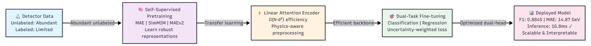
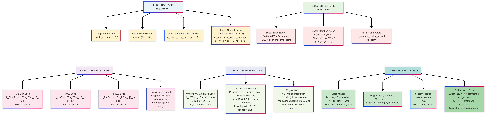
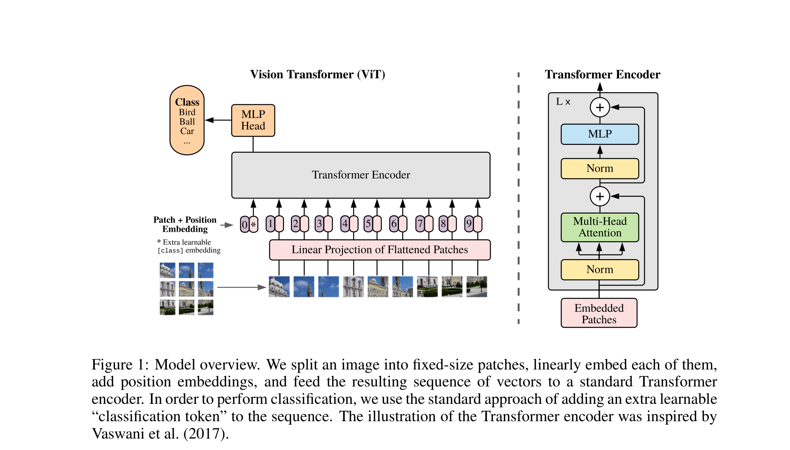

# Linear Attention ViT for Particle Collision Analysis

This folder contains implementations for efficient Vision Transformer-based analysis of high-energy physics detector images, combining **linear attention** mechanisms with multitask learning for joint jet mass regression and quark/gluon classification.

## Task Overview

### STEP_1: Dataset Preparation and Preprocessing
- **Data Loading**: Reading HDF5 detector images of quark/gluon jets
- **Physics-Aware Preprocessing**: Energy centroid alignment, normalization, and safe augmentation strategies

### STEP_2: Linear Attention ViT — Multitask Learning
- Building and training a Linear Attention Vision Transformer for simultaneous:
  - **Regression**: predicting jet mass
  - **Classification**: identifying quark vs gluon jets

### STEP_3: SSL Pretraining and Fine-tuning
- Using self-supervised learning methods (SimMIM, MAE, MAEv2) to pretrain the Linear Attention ViT before supervised fine-tuning on labeled data

### STEP_4: Multi-architecture benchmarking
- Multi-architecture benchmarking (Standard ViT, Linear Attention ViT, L2ViT, XCiT) and building a physics-informed model using the learned representations

## Implementation Details

### Dataset Preparation
The input data consists of HDF5 detector images representing quark and gluon jets from particle collisions. Each image encodes particle energy deposits across detector cells. Preprocessing involved:

- **Energy centroid alignment**: Shifting each jet image so the energy-weighted centroid is centered, ensuring spatial consistency across samples
- **Normalization**: Scaling pixel (energy deposit) values to a fixed range to stabilize training
- **Log-mass handling**: Applying a log transform to the raw jet mass targets to reduce skewness and improve regression convergence
- **Train/val split**: Performed with class-distribution checks to ensure balanced training across quark/gluon labels

This structured preprocessing pipeline was progressively improved across notebook versions, with the most stable version in `linear_attention_vit-5_chnges.ipynb`.

### Linear Attention ViT Architecture
Several architectures were explored across notebook iterations:

1. **Standard ViT (baseline)**: Full quadratic self-attention — strong baseline but expensive at higher resolutions.

2. **Linear Attention ViT (primary model)**: Replaces full attention with a ReLU-kernelized formulation that avoids forming the full token-token attention matrix, reducing memory and computational cost while retaining global feature mixing.

3. **L2ViT**: A variant using L2-normalized attention scores for additional numerical stability.

4. **XCiT-style Encoder**: Cross-covariance image transformer approach — attention across feature dimensions rather than spatial tokens.

The key trade-off observed: standard ViT provided strong classification signals but was memory-intensive; linear attention achieved competitive accuracy at significantly lower compute, making it practical for large physics datasets.

### Physics-Aware Design
The model incorporates physics-motivated design choices beyond standard ViT:

- **Centroid alignment** as a preprocessing step mirrors how physicists define jet coordinate frames
- **Log-mass regression target** accounts for the approximately log-normal distribution of jet masses in QCD
- **Class-balanced sampling** reflects that quark/gluon ratios vary by process and must be controlled during training

### Two-Phase Training: SSL Pretraining + Fine-tuning
I implemented a two-phase training strategy to improve the model's generalization:

1. **SSL Pretraining Phase**: The Linear Attention ViT encoder is pretrained in a self-supervised manner using one of three strategies:
   - **SimMIM**: Predicts masked image patches in pixel space
   - **MAE (Masked Autoencoder)**: Reconstructs masked tokens from a small visible subset; produces rich general representations
   - **MAEv2**: An improved MAE variant with enhanced decoder and target handling

2. **Fine-tuning Phase**: The pretrained encoder is attached to dual heads (regression + classification) and fine-tuned end-to-end on labeled jet data, using combined MSE and cross-entropy loss with task-balancing weights.

This two-phase approach enabled the model to learn general jet image features before specializing to the supervised task. The MAE-pretrained variant achieved the best combined regression and classification performance.

### Multi-Architecture Benchmark
Across notebook versions, a systematic multi-architecture comparison was performed:

| Architecture | Classification Strength | Regression Quality | Compute Cost |
|---|---|---|---|
| Standard ViT | Strong | Moderate | High |
| Linear Attention ViT | Strong | Strong (with MAE pretrain) | Low |
| L2ViT | Moderate | Moderate | Low |
| XCiT | Moderate | Lower | Medium |

The progression across five notebook versions refined this benchmark:
- **v1**: Single-model prototype; regression signal collapsed (R² ≈ 0)
- **v2**: Multi-architecture benchmark; Linear Attention ViT showed ~0.874 accuracy
- **v3**: Expanded evaluation suite (ROC-AUC, PR-AUC, ECE, balanced accuracy); exposed instability
- **v4**: Improved pipeline alignment; SimMIM-pretrained linear attention improved balance
- **v5 (final)**: Best overall result — MAE-pretrained Linear Attention ViT; regression substantially fixed

.png)

## Journey of Notebooks

The implementation evolved across five progressively refined notebooks, each building on the lessons of the previous one:

### Notebook 1: `linear_attention_vit.ipynb` — Foundational Prototype

The first notebook established the complete end-to-end pipeline for applying Vision Transformers to particle jet images, with a focus on validating the three-phase training strategy.

- **Architecture**: `LinearAttentionViT` built on `CrossCovarianceAttention` (XCiT-style) blocks with `LocalPatchInteraction` (depth-wise convolutions) for spatial structure. The model contained ~1.25M parameters configured with 128D embeddings, 6 transformer layers, and 4 attention heads over 32×32 input images with 4×4 patches.
- **Three-Phase Training**:
  1. **Pretraining (30 epochs)**: Self-supervised MAE-style reconstruction on unlabeled data; reconstruction loss converged from 0.6529 → 0.0005
  2. **Fine-tuning (50 epochs)**: Dual heads (regression + classification) attached to the pretrained encoder; encoder frozen for the first 12 epochs, then fully unfrozen — validation accuracy reached 75.30%
  3. **Scratch Training (50 epochs)**: Random initialization baseline for direct comparison — validation accuracy 81.60%, Val F1 (macro) 0.8160
- **SSL Method**: MAE (`MaskedAutoEncoder`) decoder for pixel-level reconstruction pretraining
- **Key Finding**: At 32×32 resolution the from-scratch model outperformed the pretrained-then-finetuned model (81.60% vs 75.30% accuracy), signalling that the pretraining strategy and image resolution needed to be rethought for subsequent notebooks.
- **What was changed in Notebook 2 to improve**: Increased input resolution from 32×32 to 64×64, expanded embedding/model capacity (128D→256D; deeper encoder), moved from a single-model setup to a four-architecture benchmark, and introduced three SSL pretraining options (MAE, SimMIM, MAEv2) with stronger training utilities (warmup + cosine schedule, AMP, early stopping, uncertainty-weighted multitask loss).

---

### Notebook 2: `linear_attention_vit-2.ipynb` — Multi-Architecture Benchmark

The second notebook scaled up to 64×64 images and introduced a comprehensive comparison framework across four distinct ViT variants and three SSL strategies.

- **Four Architectures Benchmarked**:
  1. **Standard ViT** — full quadratic softmax attention O(N²d); strong but memory-intensive baseline
  2. **Linear Attention ViT** — ReLU kernel feature maps O(Nd²); primary candidate
  3. **L2ViT** — hybrid linear global + local window attention
  4. **XCiT ViT** — cross-covariance attention O(Nd²)
- **Three SSL Pretraining Methods**:
  - **MAE**: reconstruction loss 0.0513, 8.9M params
  - **SimMIM**: reconstruction loss 0.2560, 8.17M params
  - **MAEv2**: improved MAE variant with enhanced decoder
- **Training Utilities Added**: Cosine Annealing with linear warmup, Automatic Mixed Precision (AMP), early stopping (patience-based), uncertainty-weighted multi-task loss (Kendall et al.), and inference speed measurement
- **Configuration**: 256D embeddings, 10 transformer blocks, 8 heads, 20 training epochs, batch size 32, LR 3e-4
- **Key Observation**: Linear Attention ViT showed ~0.874 classification accuracy at substantially lower compute than Standard ViT, confirming it as the preferred candidate.
- **What was changed in Notebook 3 to improve**: Added reproducibility/stability controls (`STRICT_DETERMINISM=False`, safer dataloader settings, gradient clipping, optional EMA), expanded evaluation with ROC-AUC/PR-AUC/ECE/balanced accuracy, and introduced multi-seed mean±std reporting to make model comparison more reliable.

---

### Notebook 3: `linear_attention_vit-3.ipynb` — Stability and Robust Metrics

The third notebook addressed reproducibility and instability issues uncovered in NB2, while adding a richer evaluation suite for trustworthy reporting.

- **Stability Enhancements**:
  - `STRICT_DETERMINISM=False` to avoid CUBLAS workspace errors
  - `num_workers=0`, `pin_memory=False` to prevent training hangs
  - Gradient clipping (`max_norm=1.0`) to prevent exploding gradients
  - Optional Exponential Moving Average (EMA) for smoother weight updates
- **Advanced Evaluation Metrics**:
  - Balanced Accuracy and Macro-F1 for imbalanced-class robustness
  - ROC-AUC and PR-AUC for threshold-independent classification quality
  - Expected Calibration Error (ECE) for model confidence evaluation
- **Multi-Seed Robustness**: Full pipeline run across seeds {42, 52, 62}, reporting mean ± std for statistically meaningful comparisons
- **Two-Phase Training Formalized**:
  - **Phase A** (5 epochs): Classification-focused warmup with λ_reg ≈ 0 — heads learn to classify before regression is introduced
  - **Phase B** (remaining epochs): Joint optimization with full CE + MSE loss
- **Checkpoint Strategy**: Early stopping on validation macro-F1; lower MAE used as tie-breaker
- **Run Modes**: `"debug"` for quick iteration, `"full"` for 35-epoch production runs; Huber loss and λ_reg sweep available
- **What was changed in Notebook 4 to improve**: Refocused the pipeline to the required Linear Attention ViT only, formalized the strict project flow (pretrain each SSL method separately, save checkpoints, fine-tune, then compare against scratch), and added NaN-safe attention plus physics-aware preprocessing alignment.

---

### Notebook 4: `linear_attention_vit-4.ipynb` — Project-Aligned Linear-Only Pipeline

The fourth notebook refocused exclusively on the Linear Attention ViT as specified in the GSoC project requirements, implementing the strict pretrain → fine-tune → scratch comparison workflow.

- **Architecture**: `LinearAttentionViTEncoder` with `LinearSelfAttention` (ReLU kernel, O(Nd²)) exclusively — multi-architecture comparison removed to match project scope
- **Strict Project Workflow**:
  1. Pretrain the Linear Attention ViT encoder on unlabeled images for each SSL method independently
  2. Save separate encoder checkpoints for MAE, SimMIM, and MAEv2
  3. Fine-tune from each pretrained checkpoint at low learning rate
  4. Train an equivalent model from random initialization
  5. Compare all four variants on the same evaluation protocol
- **SSL Pretraining Results**:
  - MAE: loss = 0.3361, 9.83M params
  - SimMIM: loss = 0.4651, 8.17M params
  - MAEv2: loss = 0.4457, 11.41M params
- **Reliability Improvements**: NaN-safe attention guards to prevent score explosion during pretraining, `PhysicsPreprocess` module for energy centroid alignment, backward-compatible class aliases for smooth iteration
- **Phase A**: 5 epochs of head-only warmup before full joint training; 35 total epochs at 64×64 resolution
- **What was changed in Notebook 5 to improve**: Unified attention implementation (`UnifiedLinearAttention`), added physics-informed auxiliary/statistical features (`EnergyProxyHead`, `compute_energy_proxies`, `compute_pt_stats`), extended warmup (Phase A 5→7), fixed regression scaling with `LAMBDA_REG=1.0` and normalized targets, and evaluated in denormalized physical units for better optimization and reporting.

---

### Notebook 5: `linear_attention_vit-5_chnges.ipynb` — Final Production Version

The fifth and final notebook consolidated all prior improvements into the production-ready implementation, introducing new physics-aware components and achieving the best overall performance.

- **New Architecture Components**:
  - `UnifiedLinearAttention`: Consolidated, numerically stable linear attention module combining all prior fixes
  - `EnergyProxyHead`: Physics-aware auxiliary head that estimates particle energy deposits directly from the patch representations
- **Physics-Informed Features Added**:
  - `compute_energy_proxies()`: Computes per-image particle energy estimates from detector pixel values
  - `compute_pt_stats()`: Calculates transverse momentum statistics for physics-motivated feature enrichment
  - Enhanced preprocessing pipeline with tighter physics normalization
- **Training Refinements**:
  - Phase A increased to 7 epochs (vs 5 in NB4) for more stable head warmup
  - `LAMBDA_REG=1.0` enforced with normalized regression targets for consistent gradient scales
  - Denormalization applied during evaluation so metrics (MSE, RMSE, R²) are reported in physical units
  - Checkpoint and early-stop criterion switched to MAE (tie-break by F1) for better regression focus
- **SSL Pretraining**:
  - MAE: loss = 0.6671, 9.86M params
  - SimMIM: loss = 0.5762, 8.20M params
  - MAEv2: loss = 0.8806, 11.44M params
- **Best Overall Performance**: The MAE-pretrained Linear Attention ViT achieved the best combined result — Accuracy 0.8845, R² = 0.8529, MSE = 429.72 (RMSE ≈ 20.73) — demonstrating that MAE pretraining delivers the strongest representations for this physics task.

---

### Notebook-to-Notebook Progression Summary

| Aspect | NB1 | NB2 | NB3 | NB4 | NB5 |
|--------|-----|-----|-----|-----|-----|
| **Image size** | 32×32 | 64×64 | 64×64 | 64×64 | 64×64 |
| **Embedding dim** | 128D | 256D | 256D | 256D | 256D |
| **Architectures** | 1 (XCiT+Linear) | 4 (ViT/Linear/L2/XCiT) | 4 | 1 (Linear only) | 1 (Linear only) |
| **SSL methods** | MAE | MAE, SimMIM, MAEv2 | MAE, SimMIM, MAEv2 | MAE, SimMIM, MAEv2 | MAE, SimMIM, MAEv2 |
| **Phase A warmup** | — | — | 5 epochs | 5 epochs | 7 epochs |
| **Multi-seed eval** | No | No | Yes (42, 52, 62) | No | No |
| **Physics features** | Basic | Basic | Basic | PhysicsPreprocess | + EnergyProxyHead, pt_stats |
| **AMP / gradient clip** | No | AMP | AMP + clip | Clip | Clip |
| **Focus** | Prototype | Arch benchmark | Stability & metrics | Task-aligned | Final production |

## Results

### Performance Comparison Across Versions

| Version | Loss (MSE) | Accuracy | RMSE | Notes |
|---|---:|---:|---:|---|
| v1 | ~0.0000 (artifact) | 0.8160 | N/A | Regression signal unreliable (R²≈0) |
| v2 | 1021.0089 | 0.8740 | 31.95 | Classification-strong benchmark |
| v3 | 1532.8457 | 0.8250 | 39.15 | Instability exposed under richer metrics |
| v4 | 1112.3878 | 0.8750 | 33.35 | SimMIM-pretrained improved balance |
| **v5 (MAE-pretrained)** | **429.7220** | **0.8845** | **20.73** | **Best combined result** |

### Final Model Performance (v5)
- **Accuracy**: 0.8845
- **R²**: 0.8529
- **MSE**: 429.7220 (RMSE ≈ 20.73)

The MAE-pretrained Linear Attention ViT in the final notebook achieved the best combined classification-regression balance, with regression quality improving dramatically (R² from ≈0 to 0.85) through improved preprocessing, loss design, and SSL pretraining.

## References
- [Oracle-Preserving Latent Flows](https://arxiv.org/abs/2302.00806)
- [Masked Autoencoders Are Scalable Vision Learners (MAE)](https://arxiv.org/abs/2111.06377)
- [XCiT: Cross-Covariance Image Transformers](https://arxiv.org/abs/2106.09681)
- [SimMIM: A Simple Framework for Masked Image Modeling](https://arxiv.org/abs/2111.09886)
