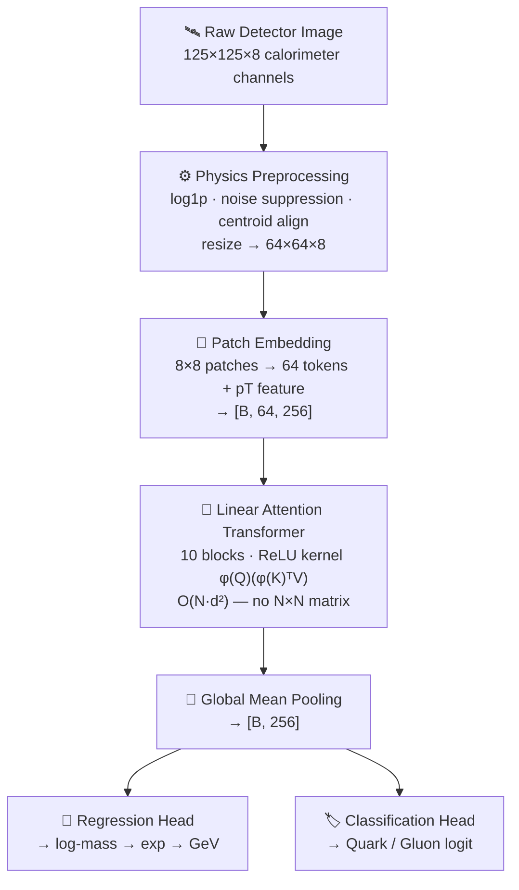

# ⚡ Linear Attention Vision Transformer for Particle Physics

> **GSoC project** — Efficient transformer-based **joint mass regression & quark/gluon jet classification** on LHC calorimeter images, developed through a rigorous 6-notebook evolution from prototype to production.

[](https://pytorch.org/)
[](https://python.org/)
[](https://developer.nvidia.com/cuda-toolkit)
[](LICENSE)

---

## 🏆 Key Highlights

- 🎯 **88.45% classification accuracy** (quark/gluon jet tagging, 2,000-sample val set)
- 📈 **R² = 0.8529** for jet mass regression (up from ≈0 at baseline)
- ⚡ **Linear Attention** — O(N²·d) → O(N·d²); ReLU kernel trick for efficient scaling
- 🔀 **Multi-task learning** — joint regression + classification in a single forward pass
- 🗃️ **70,000 jet images** (10K labeled + 60K unlabeled for self-supervised pre-training)
- 🔬 3 SSL pre-training methods compared: **MAE, SimMIM, MAEv2**

---

## 📊 At a Glance

| Metric | v1 Baseline | **v6 Final** |
|--------|-------------|-------------|
| Accuracy | 81.60% | **88.45%** |
| F1 Score | 0.816 | **0.8845** |
| ROC-AUC | — | **0.9502** |
| R² (mass regression) | ≈ 0.00 | **0.8529** |
| MAE (mass) | — | **14.87 GeV** |

---

## 🌌 Overview

Modern LHC experiments produce millions of **jet images** — 8-channel calorimeter snapshots of particle collisions (shape: `125×125×8`). Two tasks must be solved simultaneously:

1. **Regression** — predict the jet's invariant mass (continuous, GeV)
2. **Classification** — distinguish quark jets from gluon jets (binary)

Standard self-attention scales as **O(N²·d)** — prohibitive for large images. This project replaces it with **linear attention** (`φ(Q)(φ(K)ᵀV)`, φ=ReLU), reducing complexity to **O(N·d²)** while preserving expressivity. Self-supervised pre-training on 60K unlabeled jets enables powerful feature learning before fine-tuning on only 8K labeled samples.

> 📄 See [REPORT.md](REPORT.md) for full dataset details, architecture specs, and experiment logs.

---

## 🧠 Architecture



**Key details:**
- `embed_dim=256`, `depth=10`, `heads=8`, `~8.24M params`
- Loss: `CrossEntropy + λ·SmoothL1(log_mass)` with `λ=1.0`
- Two-phase training: 7 epochs (encoder frozen) → 28 epochs (full fine-tune)

---

## 🚀 Project Journey

Six notebooks, each fixing a real bug or adding a key insight:

| Version | Key Change | Best Result |
|---------|-----------|------------|
| **v1** — prototype | XCiT-style LinearViT (1.25M params), MAE pre-train | Acc=81.60%, R²≈0 |
| **v2** — scale-up | 8M params, 3 architectures, SimMIM — but mass not normalized → **100% acc bug** | MSE=2922 🐛 |
| **v3** — fix regression | Mass normalization fixed, L2ViT + XCiT added | Acc=87.40%, R²=0.65 ✓ |
| **v4** — richer eval | ROC-AUC, ECE, HPO sweep; LAMBDA_REG=0.2 | Acc=87.20%, R²=0.61 |
| **v5** — SSL comparison | All 3 SSL methods; fine-tune LR reduced 10×; centroid alignment | Acc=87.50%, R²=0.62 |
| **v6 ⭐** — final | Log-mass norm, pT feature, LAMBDA=1.0, two-phase training | **Acc=88.45%, R²=0.8529** |

> 📄 Full per-notebook analysis, debugging logs, and HPO results → [REPORT.md](REPORT.md)

---

## 📈 Performance Improvement

| Metric | Before (v1/v5) | **After (v6)** | Δ |
|--------|---------------|----------------|---|
| Accuracy | 81.60% → 87.50% | **88.45%** | **+6.85 pp** |
| R² | ≈ 0.00 → 0.619 | **0.8529** | **+0.853 🚀** |
| MAE (GeV) | — → 22.05 | **14.87** | **−32.5%** |
| XCiT / L2ViT accuracy | **50.75% (stuck)** | **84–87%** | Fixed by two-phase training |

**Breakthrough changes in v6:**
- 🔑 **Two-phase training** — fixed XCiT/L2ViT (stuck at 50.75% for 3 versions)
- 📐 **Log-space mass normalization** — R² jumped from 0.62 → 0.85
- ⚖️ **LAMBDA_REG 0.2 → 1.0** — equal task weighting; stopped classification from dominating
- 🧬 **MAE pre-training** (+5.05% accuracy vs scratch, 75% mask ratio)

---

## 🏁 Final Results (v6)

| Model | Accuracy | F1 | ROC-AUC | R² | MAE (GeV) |
|-------|----------|----|---------|-----|-----------|
| **LinAttn (MAE) ⭐** | **0.8845** | **0.8845** | **0.9502** | **0.8529** | **14.87** |
| LinAttn (SimMIM) | 0.8740 | 0.8740 | 0.9396 | 0.8159 | 16.70 |
| L2ViT | 0.8695 | 0.8694 | 0.9433 | **0.8530** | **12.06** |
| Standard ViT | 0.8615 | 0.8612 | 0.9310 | 0.7594 | 16.23 |
| XCiT (scratch) | 0.8410 | 0.8410 | 0.9143 | 0.7805 | 17.65 |

> 📄 Full benchmark with Bal.Acc, PR-AUC, ECE, MSE, training time, GPU memory → [REPORT.md](REPORT.md)

---

## 🛠️ Tech Stack

| Tool | Version | Usage |
|------|---------|-------|
| **Python** | 3.x | Core language |
| **PyTorch** | 2.3.0+cu121 | Model training |
| **h5py** | latest | HDF5 dataset I/O |
| **NumPy / scikit-learn** | latest | Preprocessing, metrics |
| **matplotlib** | latest | Visualizations |
| **CUDA** | 12.1 | GPU acceleration (RTX 4050, 6.4 GB) |
| **Jupyter Notebook** | latest | Interactive development |

---

## 📌 How to Run

```bash
# 1. Install dependencies
pip install torch torchvision --index-url https://download.pytorch.org/whl/cu121
pip install h5py numpy scikit-learn matplotlib tqdm jupyter

# 2. Place datasets in data/
#    data/Dataset_Specific_labelled_full_only_for_2i.h5   (10K labeled)
#    data/Dataset_Specific_Unlabelled.h5                  (60K unlabeled)

# 3. Open Jupyter and run the final notebook
cd "jupyter notebook"
jupyter notebook
# → Open: linear_attention_vit-5_chnges - impr.ipynb
```

**Key config in the final notebook:**
```python
LAMBDA_REG        = 1.0    # equal regression/classification weight
TWO_PHASE_TRAINING = True  # 7 frozen epochs → 28 full fine-tune epochs
LR                = 3e-5   # for pre-trained encoder
USE_PT_FEATURE    = True   # physics-informed pT feature
```

**Expected output (MAE-pretrained LinearViT):**
```
Accuracy = 88.45%  |  F1 = 0.8845  |  ROC-AUC = 0.9502
MSE = 429.72       |  MAE = 14.87 GeV  |  R² = 0.8529
```

---

## 🔮 Future Work

- [ ] **Ensemble** across 3+ seeds — expected to push accuracy to ~90%, R² > 0.88
- [ ] **Pseudo-label** the 60K unlabeled jets to scale labeled set 7×
- [ ] **Multi-scale patch embedding** (4×4 + 8×8 + 16×16) for richer jet representation
- [ ] **Full 125×125 resolution** with sliding-window attention (no downsampling loss)
- [ ] **Multi-class tagging** — top quark, W boson, Higgs, QCD background
- [ ] **Mixed-precision training (AMP)** for faster iteration

---

## 🙏 Acknowledgements

- **ML4Sci** for the particle physics dataset and problem formulation
- [XCiT](https://arxiv.org/abs/2106.09681) (El-Nouby et al., 2021) · [MAE](https://arxiv.org/abs/2111.06377) (He et al., 2021) · [SimMIM](https://arxiv.org/abs/2111.09886) (Xie et al., 2021)
- [Uncertainty-Weighted Loss](https://arxiv.org/abs/1705.07115) (Kendall & Gal, 2018)

---

*Developed as part of the ML4Sci GSoC program. For full experimental details, see [REPORT.md](REPORT.md).*

