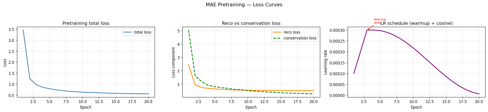
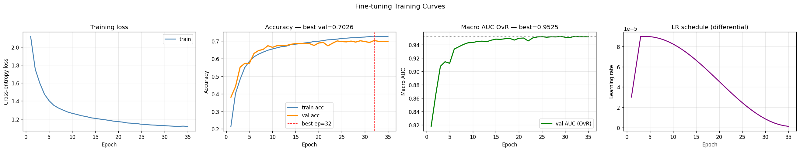
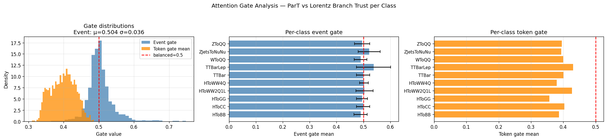

# Event Classification with Masked Transformer Autoencoders

## Overview
This repository documents a notebook-first research journey for **jet event classification** in the ML4SCI/CMS setting.

The full workflow is developed and improved through the notebook series in `notebook/`, where each next notebook refines training stability, model quality, and evaluation reliability.

The model direction combines:
- Lorentz-aware modeling ideas,
- transformer-based particle interaction modeling,
- masked autoencoder (MAE) pretraining before supervised fine-tuning.

---

## Why this project matters
For this problem, good results are not just a single final score.
This work tracks three practical goals across notebook iterations:
1. Better classification performance (accuracy and macro AUC),
2. Better run-to-run stability across random seeds,
3. Better evidence through ablations and structured comparisons.

---

## Problem setup (as used in notebooks)
- Dataset size used in workflow: `100,000` events
- Data split: `80%` train / `10%` validation / `10%` test
- Task: multi-class jet event classification
- Notebook objective: improve baseline pipeline in measurable, reproducible steps

---

## Implementation approach (notebook-driven)
The repository was developed as an iterative notebook pipeline instead of one-shot optimization.

High-level flow followed in the notebooks:
- Build a baseline hybrid architecture and full training/evaluation path,
- Add MAE pretraining and compare against no-pretraining baselines,
- Add multi-seed analysis to reduce single-run bias,
- Consolidate improvements in later notebooks and finalize benchmark settings.

This progression is what produced the final performance jump and improved consistency.

In the final notebook implementation, the approach is intentionally split into a two-stage training lifecycle: masked reconstruction pretraining first, then supervised fine-tuning on jet labels. This design is used so the model learns general particle-structure priors before the classification objective is applied, which is consistent with the notebook discussion around stability and transfer of useful representations.

At implementation level, the architecture combines a ParT-style interaction branch and a Lorentz-aware branch, then uses attention-gated fusion to combine complementary signals instead of relying on a single representation pathway. The final notebook also documents practical engineering details used during runs, including compile/acceleration helpers, explicit numerical safeguards in feature construction, and disciplined validation-based model selection (macro AUC first, with accuracy fallback when needed).

The notebook implementation also emphasizes why each engineering choice exists. Log-normalized kinematic features and pairwise ParT-style features are used to reduce scale mismatch and make interaction structure easier for the model to learn. In pretraining, the masked reconstruction objective is feature-aware (including angular handling for `phi`) so that the learned latent space reflects particle-level geometry instead of only optimizing a generic loss. During supervised fine-tuning, checkpointing tracks macro AUC first to stay aligned with multi-class discrimination quality, while an explicit accuracy fallback protects training control flow when AUC cannot be computed for a specific epoch.

Another practical part of the approach is reliability-focused optimization: speed helpers (`torch.compile` with fallback behavior) and cuDNN benchmarking are used to accelerate iteration without changing model semantics, while multi-seed evaluation is used to confirm that gains are not from a single favorable initialization. This implementation discipline is important in the notebook workflow because every stage is compared against prior stages using the same split logic and metric definitions.

### Detailed section-wise content (from final notebook only)
From `notebook/6-Hybrid_LorentzParT_MAE_GSoC2026_FINAL -.ipynb`, the workflow is explicitly organized as:

- **SECTION 1 — INTRODUCTION & MOTIVATION**
  - Frames jet tagging at the LHC as the core problem and states why stronger background rejection improves analysis sensitivity.
  - Explains why self-supervised pretraining is used before supervised labels, and reports the corrected pretraining impact compared with prior work.
  - Gives component-level motivation table: ParT, Lorentz blocks, Class Attention, MAE, VICReg, attention-gated fusion, and `torch.compile`/cuDNN acceleration.
  - Lists concrete “Improvements Over GSoC 2025” across features, normalization, reconstruction loss, architecture, pooling, speed, and evaluation protocol.

- **SECTION 2 — SETUP / SECTION 2b — SPEED & REGULARISATION HELPERS**
  - Standardizes reproducible setup and training environment.
  - Integrates drop-in speed toggles and VICReg regularization helpers from the final notebook pipeline.
  - Notes compile fallback behavior where `torch.compile` may revert to eager mode when Triton is unavailable.

- **SECTION 3 — DATA UNDERSTANDING / SECTION 4 — ROOT DATA LOADING**
  - Documents data inspection and loading path before modeling.
  - Keeps event-level preparation and split flow aligned with the 100k-event benchmark used for reporting.

- **SECTION 5 — FEATURE ENGINEERING**
  - Uses particle features: `px, py, pz, E`, `pt, eta, phi`, `charge`, `valid_mask`.
  - Builds ParT-style pairwise features: `ln(Delta)`, `ln(kT)`, `ln(z)`, `ln(m^2)`.
  - Includes numerical safeguards (`eps`, clamping, NaN/Inf cleanup) and log-normalized kinematics.

- **SECTION 6 — MASKED AUTOENCODER PRETRAINING DATA PIPELINE**
  - Defines masked-particle reconstruction pipeline used to learn representations before supervised jet tagging.

- **SECTION 7 — MODEL DESIGN / SECTION 7b — ARCHITECTURE OVERVIEW**
  - Implements hybrid ParT + Lorentz-aware branch design with attention-gated fusion.
  - Uses CLS-token style decision pathway with class-attention blocks in the supervised head.
  - Provides full architecture overview from particle 4-vectors to jet class output.

- **SECTION 8 — LOSS FUNCTIONS**
  - Uses physics-aware reconstruction objective details highlighted in notebook narrative (Smooth-L1, angular handling for `phi`, weighted feature reconstruction).

- **SECTION 9 — TRAINING UTILITIES**
  - Organizes schedulers, checkpoint logic, and training helpers used across pretraining and fine-tuning.

- **SECTION 10 — EVALUATION METRICS**
  - Emphasizes macro AUC and accuracy as primary metrics for selection and reporting.

- **SECTION 11 — PRETRAINING RUN / SECTION 12 — FINE-TUNING RUN**
  - Runs two-stage training: MAE pretraining first, then supervised fine-tuning.
  - Uses validation macro AUC (OvR) as primary selector; if AUC is undefined (`NaN`) for an epoch, selection falls back to validation accuracy for stability.

- **SECTION 13 — ABLATION STUDY (+ Multi-seed statistical evaluation)**
  - Quantifies hybridization gain (ParT-only vs Lorentz-only vs gated hybrid).
  - Quantifies MAE effect (with pretraining vs from scratch).
  - Runs multi-seed reporting as mean ± std to avoid cherry-picked single-run claims.
  - Notes short-run ablations are for relative comparison while final reported model uses full schedule.

- **SECTION 14b — MASS REGRESSION RESULTS**
  - Adds optional multi-task mass regression branch via `cfg.USE_AUX_MASS = True`.
  - States this extension directly addresses the GSoC 2026 requirement to include particle mass regression.

---

## Notebook-derived project explanation
This project addresses **jet tagging at the LHC**, where each collision event produces jets that must be classified into physics categories such as Higgs/top/W/Z or QCD background. In the final notebook narrative, the central idea is that stronger event representations before supervised training can improve both final classification quality and seed-to-seed robustness.

The approach uses **masked autoencoder pretraining** on particle-level inputs first, then performs supervised fine-tuning for jet class prediction. This follows the practical logic that pretraining can learn generic particle-structure patterns before the classifier is optimized for the target labels.

The model design combines transformer-style interaction modeling with Lorentz-aware inductive bias in a hybrid pipeline. Notebook ablations and multi-seed summaries are used as evidence that gains are not only from one lucky run, but are supported by structured comparisons.

### Point-wise explanation of the notebook workflow
- **Problem motivation:** Jet tagging quality directly impacts physics-analysis sensitivity, so both performance and reliability are important.
- **Data pipeline goal:** Keep train/validation/test handling explicit and reproducible across notebook iterations.
- **Representation-learning step:** Use MAE pretraining to build stronger latent features before classification.
- **Supervised step:** Fine-tune the hybrid classifier and monitor macro AUC/accuracy for model selection.
- **Ablation step:** Compare with/without pretraining and branch variants to isolate what actually helps.
- **Stability step:** Re-run with multiple random seeds and report mean ± std to reduce single-run bias.
- **Finalization step:** Consolidate successful settings into the final benchmark notebook configuration.

### Point-wise explanation of what improved across iterations
- **Training stability improved** through better scheduler/selection flow and more disciplined evaluation blocks.
- **Feature handling improved** through normalization and iterative tuning updates.
- **Pretraining impact became clearer** with stronger pretraining + longer fine-tuning strategy in later stages.
- **Evidence quality improved** by adding multi-seed reporting and explicit ablation comparisons.
- **Final metrics improved** while preserving reproducibility checks rather than optimizing only one run.

---

## Final headline results
From `notebook/6-Hybrid_LorentzParT_MAE_GSoC2026_FINAL -.ipynb`:
- **Test Accuracy:** `0.7020` (70.2%)
- **Macro AUC (OvR):** `0.9536`
- **Macro AUC (OvO):** `0.9536`

### MAE pretraining effect (final notebook summary)
- **Accuracy gain:** `+0.0282` (~+2.8%)
- **AUC gain:** `+0.0070`
- Reported as substantially lower variance with pretraining in multi-seed comparisons

---

## Notebook Journey (research progression)
Each notebook is a concrete stage in the model evolution.

| Notebook | What changed in this stage | Reported test accuracy | Reported macro AUC (OvR) |
|---|---|---:|---:|
| `1-Hybrid_Lorentz_ParT_MAE_JetClass_GSoC2026.ipynb` | Initial complete hybrid MAE pipeline with baseline ablations/diagnostics | `0.6467` | `0.938316` |
| `2-Hybrid_Lorentz_ParT_MAE_JetClass_GSoC2026 .ipynb` | Added stronger scheduler/logging organization and explicit multi-seed evaluation structure | `0.6093` | `0.9267` |
| `3-Hybrid_Lorentz_ParT_MAE_JetClass_GSoC2026.ipynb` | Added mass-target normalization and training behavior tuning | `0.6464` | `0.9393` |
| `3_v6-Hybrid_Lorentz_ParT_MAE_JetClass_GSoC2026.ipynb` | Stronger pretraining + longer fine-tuning strategy | `0.7018` | `0.9524` |
| `4-Hybrid_Lorentz_ParT_MAE_JetClass_GSoC2026.ipynb` | Consolidated improvements and stricter seeded robustness checks | `0.6968` | `0.9521` |
| `6-Hybrid_LorentzParT_MAE_GSoC2026_FINAL -.ipynb` | Final polished benchmark configuration | **`0.7020`** | **`0.9536`** |

### Interpreting the journey
- Intermediate steps are not strictly monotonic, which is expected in real experimentation.
- The major jump appears in the `3_v6` stage onward.
- Final notebooks preserve these gains while improving reproducibility discipline.

### What was changed in each next notebook to improve implementation
- **NB1 → NB2**
  - Added clearer scheduler/logging flow and explicit multi-seed evaluation block.
  - Improvement target: better reliability and easier apples-to-apples comparisons.

- **NB2 → NB3**
  - Added mass-target normalization and tuning updates.
  - Improvement target: recover performance and improve feature-scale handling.

- **NB3 → NB3_v6**
  - Strengthened MAE pretraining and extended fine-tuning strategy.
  - Improvement target: improve latent representation quality before supervised optimization.

- **NB3_v6 → NB4**
  - Consolidated successful changes and enforced stronger seeded checks.
  - Improvement target: verify gains are stable across runs.

- **NB4 → NB6 (Final)**
  - Finalized benchmark configuration and optimization stack.
  - Improvement target: maximize final score while preserving reproducibility.

---

## Stability & reproducibility evidence
From `notebook/4-Hybrid_Lorentz_ParT_MAE_JetClass_GSoC2026.ipynb` multi-seed summary:

- **With pretraining:**
  - `test_acc = 0.6993 ± 0.0013`
  - `test_auc_ovr = 0.9524 ± 0.0006`

- **Without pretraining:**
  - `test_acc = 0.6866 ± 0.0059`
  - `test_auc_ovr = 0.9490 ± 0.0014`

What this shows:
- Pretraining increases the **mean** score (both accuracy and AUC).
- Pretraining also reduces **variance** across random seeds, especially for accuracy.
- The gap in standard deviation (`±0.0013` vs `±0.0059`) supports the claim that MAE pretraining is not only better, but also more stable to initialization.

---

## Ablation insights
From final notebook ablation outputs:
- `with_mae_pretrain`: `val_acc = 0.5961`, `val_auc = 0.919528`
- `no_mae_pretrain`: `val_acc = 0.5726`, `val_auc = 0.911468`

Interpretation from ablation sections:
- The MAE branch gives a consistent validation lift before final test evaluation.
- Validation trends align with the final test summary (`+0.0282` accuracy and `+0.0070` AUC in the final notebook report), so the effect is not isolated to one metric.
- The ablation is used as a control check: keeping the core supervised setup similar while toggling pretraining isolates representation-learning impact.

Relevant training evidence:

---

## Architecture and training design notes (from notebook sections)
The final pipeline integrates:
- hybrid branch design with attention-gated fusion,
- MAE pretraining followed by supervised fine-tuning,
- class-attention/CLS-style decision structure,
- optional mass-regression study branch,
- engineering optimizations (`torch.compile`, cuDNN benchmark usage in final notebook).

Notebook-section design notes:
- **Input/modeling intent:** particle-level features are modeled with transformer-style interactions to capture inter-particle dependencies.
- **Fusion intent:** attention-gated combination is used to blend branch information while keeping useful complementary signals.
- **Training strategy:** two-stage flow (self-supervised pretraining → supervised fine-tuning) is kept explicit and measured with comparable evaluation blocks.
- **Evaluation discipline:** model selection and reporting emphasize macro AUC + accuracy with seeded checks and per-class inspection instead of a single scalar score.

### Approach breakdown (implementation-centric)
- **Data and representation approach:** use event-level particle tensors with physics-guided feature engineering (`px, py, pz, E`, derived kinematics, pairwise ParT features) plus masking utilities for self-supervised learning.
- **Modeling approach:** keep two complementary branches (ParT interactions and Lorentz-aware mixing), then fuse them with learned gates before class-attention-based final decision layers.
- **Optimization approach:** train in two phases (pretraining then fine-tuning), retain reusable utilities (scheduler/checkpoint helpers), and apply acceleration toggles that do not alter objective definitions.
- **Validation approach:** select models with macro AUC (OvR) as primary signal, keep accuracy as a robust fallback, and report multi-seed mean ± std to support reproducibility claims.
- **Ablation approach:** isolate individual contributors (hybridization and MAE pretraining) with controlled comparisons before reporting final benchmark results.

---

## Repository structure
- `notebook/` — complete notebook lifecycle from baseline to final benchmark
- `images/` — selected relevant figures referenced across analysis sections in this README
- `Research paper/` — local reference PDFs
- `README.md` — notebook-driven narrative summary
- `readme (2).md` — format/style reference used for this README rewrite

---

## How to read this work in order
1. `notebook/1-Hybrid_Lorentz_ParT_MAE_JetClass_GSoC2026.ipynb`
2. `notebook/2-Hybrid_Lorentz_ParT_MAE_JetClass_GSoC2026 .ipynb`
3. `notebook/3-Hybrid_Lorentz_ParT_MAE_JetClass_GSoC2026.ipynb`
4. `notebook/3_v6-Hybrid_Lorentz_ParT_MAE_JetClass_GSoC2026.ipynb`
5. `notebook/4-Hybrid_Lorentz_ParT_MAE_JetClass_GSoC2026.ipynb`
6. `notebook/6-Hybrid_LorentzParT_MAE_GSoC2026_FINAL -.ipynb`

Recommended pattern per notebook:
1. introduction/improvement and scope,
2. model/data sections,
3. pretraining/fine-tuning outputs,
4. ablation and multi-seed outputs,
5. final discussion block.

---

## Conclusion
This repository shows a full notebook-to-benchmark journey where MAE pretraining and iterative architecture/training refinements improved both quality and stability.

The final notebook result (`0.7020` accuracy, `0.9536` macro AUC) is the endpoint of staged improvements rather than a single isolated run.

---

## References (from final notebook)
- Qu et al. (2022). *Particle Transformer for Jet Tagging.* [arXiv:2202.03772](https://arxiv.org/abs/2202.03772)
- Spinner et al. (2024). *Lorentz-Equivariant Geometric Algebra Transformers for High-Energy Physics.* [arXiv:2405.14806](https://arxiv.org/abs/2405.14806)
- He et al. (2022). *Masked Autoencoders Are Scalable Vision Learners.* CVPR 2022. [arXiv:2111.06377](https://arxiv.org/abs/2111.06377)
- Bardes et al. (2022). *VICReg: Variance-Invariance-Covariance Regularization.* ICLR 2022. [arXiv:2105.04906](https://arxiv.org/abs/2105.04906)
- Touvron et al. (2021). *Going deeper with Image Transformers (CaiT).* ICCV 2021. [arXiv:2103.17239](https://arxiv.org/abs/2103.17239)
- Nguyen (2025). *GSoC 2025 — Event Classification with Masked Transformer Autoencoders.* [Medium](https://medium.com/@thanhnguyen14401/gsoc-2025-with-ml4sci-event-classification-with-masked-transformer-autoencoders-6da369d42140)
